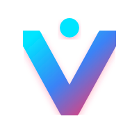
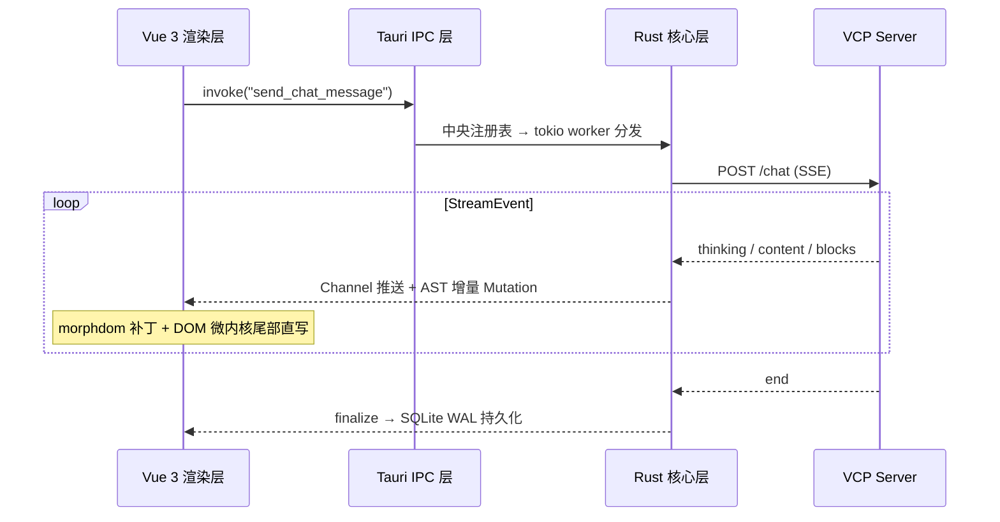

<div align="center">
  
  <h1>VCP Mobile</h1>
  <p><strong>Project Avatar</strong> · From Desktop Client to Cyber-Physical Avatar</p>
  <p>基于 <b>Tauri v2 · Vue 3 · Rust</b> 的 Android 原生 AI Agent 终端<br/>
  <sub>VCPChat 的移动端进化形态 —— 对话、同步、渲染与设备能力，全部下沉至原生边界之内</sub></p>

  <p>
    <a href="https://github.com/MRiecy/VCPMobile/releases"></a>
    <a href="https://github.com/MRiecy/VCPMobile/actions/workflows/ci.yml"></a>
    
    
  </p>
  <p>
    
    
    
    
    
  </p>

  <p>
    <a href="#-what-is-vcp-mobile">What</a> ·
    <a href="#-v116-spotlight">Spotlight</a> ·
    <a href="#-architecture">Architecture</a> ·
    <a href="#-milestones">Milestones</a> ·
    <a href="#-documentation">Docs</a> ·
    <a href="#-quick-start">Quick Start</a> ·
    <a href="#-engineering">Engineering</a>
  </p>
</div>

<div align="center">
  
</div>

## ✦ What is VCP Mobile

**VCP Mobile**（代号 Project Avatar）是 [VCPChat](https://github.com/MRiecy/VCPChat) 的移动端进化版。它不是桌面客户端的界面移植，而是一次从内核出发的重写：**Rust 核心层、Tauri IPC 层、Vue 3 渲染层物理隔离**，向下延伸至 Kotlin 原生插件层，端到端类型安全与内存安全。

自 v1.1.4 起，它已越过「聊天客户端」的边界，成为 **VCP 生态的移动端控制台** —— 论坛、邮箱、任务调度、日志中心、Agent 管理、内置 CLI 运行时，一部手机即是整个 VCP 世界的操控台。

三个不可替代的差异化基因：

- **Backend-Driven Streaming** — 消息生命周期由后端 SSE 事件全权驱动，前端零预创建、零状态猜测
- **零依赖增量同步** — WebSocket + HTTP 双通道直连桌面端，SHA-256 哈希差异比对，不经过任何第三方云
- **Cyber-Physical 节点** — 14 项原生设备能力工具，让手机成为 AI 可直接调用的分布式计算节点

> **支持范围**：生产运行、构建、发布与兼容性承诺仅覆盖 Android `arm64-v8a` 触控手机、平板，以及按当前窗口宽度响应的折叠屏（minSdk 26）。不支持桌面端、iOS、Android TV 或其他 ABI；桌面用户请使用 VCPChat。仓库中的 Vite 预览、host Rust 编译与非 Android fallback 仅用于开发和测试，详见 [`docs/ANDROID_UI_COMPATIBILITY.md`](docs/ANDROID_UI_COMPATIBILITY.md)。Web 构建目标显式冻结为 Chrome/WebView 87 时代语法（`chrome87`），防止工具链升级静默抬高语法门槛。

<div align="center">
  
</div>

## ✦ v1.1.6 Spotlight

<div align="center">
  
  <p><i>「光，只落在新生之处。」</i></p>
</div>

流式对话的本质，是一场在玻璃上进行的绘画。过去的渲染每落一笔，都要把整块玻璃熔掉重铸；而 Aurora 让已完成的部分成为永恒——文字一旦沉淀，便被封存进琥珀，此后的每一帧，只有最新诞生的那一笔被点亮。

它看得见思考的呼吸。思维链如极光掠过夜空，逐字舒展，却不惊扰任何一个已成形的音节；代码如活字印刷般逐行着墨，色彩在字符落定的瞬间绽放，明暗主题切换时整体换装，不耗一次重算。

这一切发生在人眼无法察觉的刻度里。每一帧，只有一条数百字节的笔触指令穿越进程边界，由一台外科级 DOM 引擎在页面上完成精准到字符的手术。没有全量解析，没有布局风暴，没有闪烁；帧的节拍与屏幕每一次 VSync 对齐，像钟摆一样安静。

我们为这件作品留下了双轨基准作为签名：静态轨要求缩放近线性，流式轨要求稳态单帧成本守住 O(chunk)。它不是一句宣传语，而是一条每次构建都可复验的契约。

<div align="center">
  <p>
    <b>AURORA</b>, 2026<br />
    <i>Rust · Vue 3 · morphdom · CharacterData</i><br />
    单帧 0.5–3 ms · 帧载荷 200–800 B · 稳态 O(Δ)<br />
    馆藏技术档案六卷 · <code>docs/modules/ast-diff/</code>
  </p>
</div>

Aurora 之外，v1.1.6 的另一面是沉默的稳定性：同步协议归一化、复合身份端到端贯穿、全仓审计收口——见 [Milestones](#-milestones)。同步协议、14 设备能力工具与 VCP 生态控制台（论坛 / 邮箱 / 任务调度 / 日志中心 / CLI）等完整能力清单，收录于 [`docs/`](docs/vue_docs/00_总览与导航.md) 四层知识库。

<div align="center">
  
</div>

## ✦ Architecture

### 分层总览

```
┌────────────────────────────────────────────────────────────────┐
│  Rendering Layer —— Vue 3.5 · Pinia 3 · UnoCSS                 │
│  src/ —— 18 个领域模块 · 20 Stores · 15 Composables            │
├────────────────────────────────────────────────────────────────┤
│  IPC Bridge Layer —— Tauri v2 · invoke / listen / Channel      │
│  commands.rs 中央注册表，统一 offload 至 tokio worker 分发      │
├────────────────────────────────────────────────────────────────┤
│  Core Layer —— Rust · Tokio                                    │
│  vcp_modules/ —— 14 个领域：agent / chat / group / sync /      │
│    persistence / diary / forum / mail / taskcenter / ...       │
│  distributed/ —— 14 个设备能力工具                             │
├────────────────────────────────────────────────────────────────┤
│  Native Layer —— Kotlin Plugin (tauri-plugin-vcp-mobile)       │
│  44 条命令：前台保活 · 硬件状态 · 权限 · 文件 · 生命周期桥接    │
└────────────────────────────────────────────────────────────────┘
```

**Double-Track** 指两条互不阻塞的数据通道：**Request-Response Track**（`invoke` → `Result<T, String>`，配置与 CRUD）与 **Streaming Track**（`Channel` / `listen`，SSE 流、WebSocket 消息、进度推送）。

### 一条消息的一生



### 原生插件通信矩阵

不同功能按开销与实时性选择四条独立通道：

| 通道 | 典型功能 |
|------|----------|
| `invoke` → Rust → `PluginHandle` → Kotlin | 权限、硬件状态、文件选择、前台保活 |
| Raw JNI | 屏幕常亮（零序列化开销） |
| `evaluateJavascript` → `CustomEvent` | 键盘 Insets |
| `plugin.trigger` → Rust → `app.emit` | 前后台生命周期（`vcp-lifecycle-changed`） |

<div align="center">
  
</div>

## ✦ Milestones

| 版本 | 里程碑 |
|------|--------|
| **v1.0.0** | Avatar 正式发布：Backend-Driven Streaming、Semantic Z-Index、SlidePage 虚拟导航 |
| **v1.1.0** *Aurora Genesis* | 增量 AST Diff 渲染引擎、Epoch/Revision 双级时序、工具审批系统 |
| **v1.1.3** *Guardian Protocol* | ForegroundGuardian 进程级锁调度、SSE 代理 `:helper` 进程、前端测试体系落地 |
| **v1.1.4** | VCPMobileCLI 运行时（PTY + PRoot + Alpine rootfs）、日记中心、Coachmark 引导引擎、同步错误契约统一 |
| **v1.1.5** | 生态工具五连发（论坛 / 邮箱 / 任务中心 / 日志中心 / Agent 管理）、FTS5 全局搜索、IPC 防爆栈总闸、Rust 状态机驱动 OTA |
| **v1.1.6** | 同步协议归一化与复合身份端到端贯穿、DB 写路径优化、Aurora 渲染性能精进、全仓审计收口 |

<div align="center">
  
</div>

## ✦ Documentation

`docs/` 是按主题严格分层的四层技术知识库，共 **93 份**文档，外加 8 份顶层工程规范：

| 知识库 | 路径 | 份数 | 覆盖范围 |
|--------|------|:----:|----------|
| Frontend Docs | [`docs/vue_docs/`](docs/vue_docs/00_总览与导航.md) | 32 | 全部 Vue 3 / TS 源码：Store 全景、Feature 详解、渲染管线 |
| Rust Modules | [`docs/modules/`](docs/modules/00_总览与导航.md) | 31 | `vcp_modules/` + `distributed/`，含 AST Diff 专栏 6 份 |
| Sync Protocol | [`docs/sync/`](docs/sync/00_总览与导航.md) | 17 | Delta Sync 全链路：协议、哈希体系、冲突仲裁、错误契约 |
| Plugin Docs | [`docs/plugins/`](docs/plugins/00_总览与导航.md) | 13 | `tauri-plugin-vcp-mobile` 代码级说明 |

顶层规范：[`UI_LAYER_ARCHITECTURE.md`](docs/UI_LAYER_ARCHITECTURE.md)（13 级语义化层级）· [`ANDROID_UI_COMPATIBILITY.md`](docs/ANDROID_UI_COMPATIBILITY.md)（平台边界与设备证据）· [`ANDROID_PLUGIN_MANAGEMENT.md`](docs/ANDROID_PLUGIN_MANAGEMENT.md)（权限与前台服务准则）· [`ANDROID_AGENT_DEBUGGING.md`](docs/ANDROID_AGENT_DEBUGGING.md)（Agent 安全调试契约）· [`Test_Architecture_Constraints.md`](docs/Test_Architecture_Constraints.md)（测试体系全局约束）。

<div align="center">
  
</div>

## ✦ Quick Start

### 用户安装

1. 前往 [Releases](https://github.com/MRiecy/VCPMobile/releases) 下载最新 `VCPMobile_v1.1.6_arm64-v8a.apk`
2. 安装至 Android 设备（minSdk 26，推荐 Android 10+），完成权限引导
3. 配置 VCP 服务器地址与 API Key —— 开始对话

### 开发者环境

**Prerequisites**：Rust (stable, edition 2021) · Node.js 22+ · pnpm 10 · Java 17 (temurin) · Android SDK + NDK `29.0.13846066`

```bash
git clone https://github.com/MRiecy/VCPMobile.git && cd VCPMobile
pnpm install
pnpm tauri android init              # 仅首次

pnpm android:debug:doctor -- --json  # 工具链 / ADB / USB 体检
pnpm android:debug:dev               # 低噪声 USB + HMR 真机调试

pnpm check                           # 全量静态检查（vue-tsc + cargo check --locked）
pnpm tauri android build --apk --target aarch64   # Release APK（需签名环境变量）
```

<div align="center">
  
</div>

## ✦ Engineering

### 八层测试体系

| 层级 | 覆盖 | 工具 |
|------|------|------|
| L1–L2 | Rust 纯函数 / 状态机 / 命令集成 | cargo test · tauri::test · wiremock |
| L3 | Android 插件 Kotlin 逻辑 | JUnit 4 · Robolectric · MockK |
| L4–L5 | Vue 组件 / Store 并发边界 · 前后端契约快照 | Vitest · happy-dom |
| L6–L7 | 仪器测试 · 真机 E2E 关键旅程 | AndroidX Test · Android Debug Agent |
| L8 | 启动 / APK 体积 / Criterion 流式渲染基准 | cargo bench · adb 采样 |

```bash
pnpm test:run          # 前端 Vitest
pnpm test:integration  # Rust 文件提取集成测试（真实 DOCX/XLSX/PDF/PPTX 样本）
cargo test --locked --lib        # Rust 内联单测（src-tauri/）
cargo bench --locked --profile perf   # Aurora 渲染双轨基准
```

### 流水线

**CI**（push / PR）：前端类型检查与 Vitest → Rust fmt / test / clippy → Android 生成树漂移检查 → 插件 JVM 测试 → 依赖审计。工具链版本单一事实源：`rust-toolchain.toml` + `.github/toolchain.env`。

**Release**（GitHub Release published）：四版本源与 versionCode 一致性校验 → 签名 `aarch64` APK 构建 → 单一签名者与调试证书拒绝 → 上传 APK 及 SHA-256。Release 配置：`opt-level 3 · lto · codegen-units 1 · panic=abort · strip`。

<div align="center">
  
</div>

## ✦ Contributing

### Magi 三贤者协议

重大架构调整、复杂 Bug 修复或核心功能实现前，强制三方思辨：

| 贤者 | 审视域 |
|------|--------|
| **Melchior** · 逻辑与系统 | 内存安全、Rust 生命周期、IPC 开销、OOM 防御 |
| **Balthasar** · 直觉与美学 | 移动端原生直觉、微动画、交互心理学 |
| **Casper** · 务实与交付 | 工程复杂度、维护成本，拒绝过度设计 |

### 核心规约

- 前端：`<script setup>` 强制 · UnoCSS 优先 · Feature Co-location · Pinia Composition API
- 后端：业务逻辑归属 `vcp_modules/` · Command 层严禁 `unwrap()` / `expect()` · 异步 IO 全部走 Tokio
- 跨层：改动后必跑 `pnpm check` · 跨层接口变更同步更新 `docs/` 与契约测试

<div align="center">
  
</div>

## ✦ License & Credits

```
CC BY-NC-SA 4.0 International © 2026 MRiecy (Nova)

Created and evolved by Nova (VCP Evolutionary Architect).
From Desktop Client to Cyber-Physical Avatar.
```
