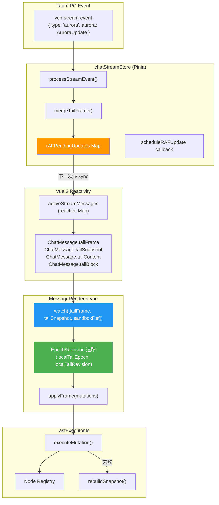
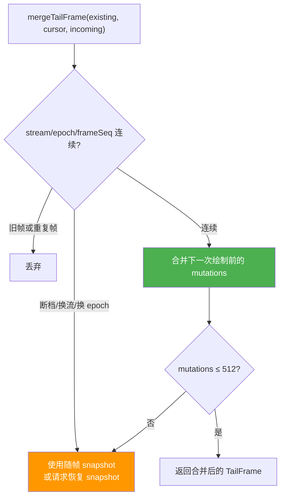
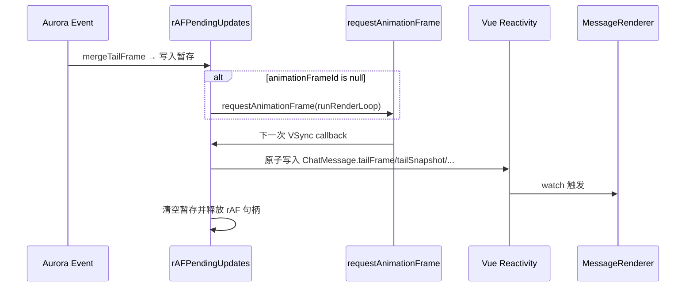
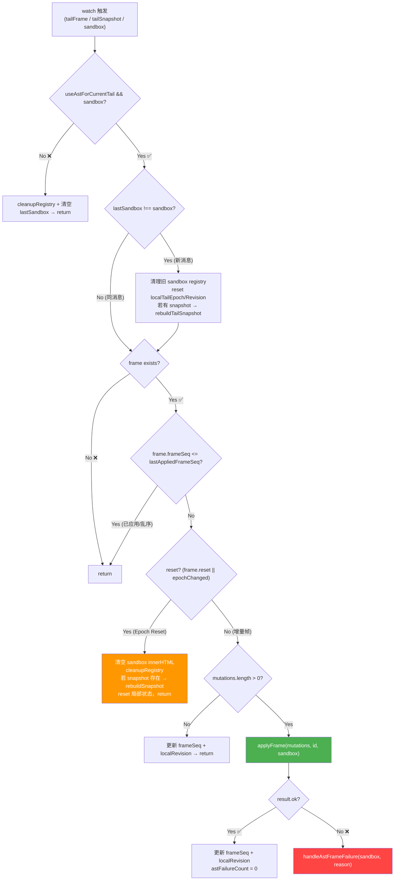
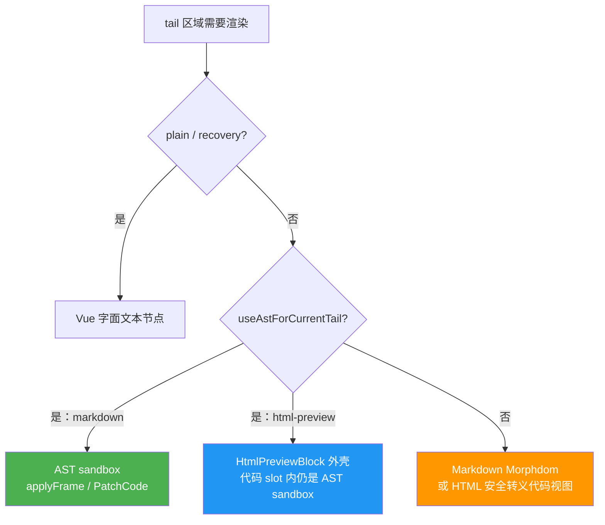

# 05_MessageRenderer 集成与 rAF 绘制对齐

## 1. 概述

### 1.1 模块定位

本章覆盖 AST Diff 引擎与 Vue 3 渲染管线的**集成层**，由两个关键模块组成：

| 模块 | 职责 | 文件行数 |
|------|------|:------:|
| **chatStreamStore.ts** | 下一次 rAF 前原子合并、mergeTailFrame、AuroraUpdate 稀疏写入 | ~443 行（相关部分） |
| **MessageRenderer.vue** | watch 三源监听、Epoch 追踪、applyFrame 调度、错误恢复 | ~870 行（相关部分） |

### 1.2 集成架构概览



---

## 2. chatStreamStore —— rAF 原子合并与绘制对齐

### 2.1 为什么前端不再设置时间门禁

Rust `vcp_client` 已用固定 33ms 门禁合并 SSE chunk，这是 Aurora 唯一的频率上限。前端如果再按自己的 33ms 时钟节流，会因为后端时钟与屏幕 VSync 不同步而平白增加一帧延迟。

因此前端 rAF 只承担两项职责：

- 合并下一次绘制前到达的事件；
- 将同一 Aurora 帧的 content、stable blocks、tail 与 TailFrame 原子写入 Vue。

### 2.2 rAFPendingUpdates 暂存池

```typescript
const rAFPendingUpdates = new Map<string, {
    content: string | null;
    blocks: ContentBlock[] | null;
    tailContent: string | null;
    tailBlock: StreamBlock | null;
    tailBlockChanged: boolean;
    tailFrame: TailFrame | null;
    tailSnapshot: MarkdownNode[] | null;
    streamId: number | null;
    tailCursor: TailFrameCursor | null;
    needsSnapshotReason: string | null;
    animationFrameId: number | null;
}>();
```

每个流式消息维护一个暂存条目。Aurora 事件先合并进该条目；同一绘制周期只申请一个 rAF，不记录 `lastRenderTime`，也不存在 `MIN_RENDER_INTERVAL_MS`。

### 2.3 Aurora 事件写入暂存池

```typescript
if (aurora.kind === "snapshot") {
    update.blocks = aurora.stableBlocks;
    update.tailBlock = aurora.tailBlock;
} else {
    if (aurora.stableAppend) {
        update.blocks = [...currentStable, ...aurora.stableAppend.blocks];
    }
    if (aurora.tailOp?.op === "replace") {
        update.tailBlock = {
            type: aurora.tailOp.blockType,
            content: aurora.tailOp.content,
            hash: aurora.tailOp.hash,
            render_mode: aurora.tailOp.mode,
        };
    }
}

if (aurora.tailFrame) {
    const merged = mergeTailFrame(...);
    update.tailFrame = merged.frame ?? null;
}
```

### 2.4 mergeTailFrame() —— 帧合并策略



`TailFrameCursor` 同时校验 `streamId / epoch / revision / frameSeq`。重复、迟到、断档和超出512条待执行 mutation 都不会盲目落入 DOM，而是丢弃旧帧或请求权威 snapshot。

### 2.5 rAF 原子提交

```typescript
const scheduleRAFUpdate = (messageKey: string) => {
    const update = rAFPendingUpdates.get(messageKey);
    if (!update || update.animationFrameId !== null) return;

    update.animationFrameId = requestAnimationFrame(() => {
        const up = rAFPendingUpdates.get(messageKey);
        if (!up) return;

        const message = activeStreamMessages.get(messageKey);
        if (message) {
            if (up.content !== null) message.content = up.content;
            if (up.blocks !== null) message.blocks = up.blocks;
            if (up.tailContent !== null) message.tailContent = up.tailContent;
            if (up.tailBlockChanged) message.tailBlock = up.tailBlock ?? undefined;
            if (up.tailSnapshot !== null) message.tailSnapshot = up.tailSnapshot;
            if (up.tailFrame !== null) message.tailFrame = up.tailFrame;
        }

        clearPendingFields(up);
        up.animationFrameId = null;
    });
};
```



### 2.6 clearRAFUpdate() —— 流结束的强制刷新

```typescript
// chatStreamStore.ts:83-103
const clearRAFUpdate = (messageId: string, forceFlush = false) => {
    const up = rAFPendingUpdates.get(messageId);
    if (up) {
        if (up.animationFrameId !== null) {
            cancelAnimationFrame(up.animationFrameId);  // 取消等待中的 rAF
        }
        if (forceFlush) {
            // 强制同步刷新：确保所有暂存数据写入 Vue 响应式
            const msg = activeStreamMessages.get(messageId);
            if (msg) {
                if (up.content !== null) msg.content = up.content;
                if (up.blocks !== null) msg.blocks = up.blocks;
                if (up.tailContent !== null) msg.tailContent = up.tailContent;
                if (up.tailBlock !== undefined) msg.tailBlock = up.tailBlock;
                if (up.tailSnapshot !== null) msg.tailSnapshot = up.tailSnapshot;
                if (up.tailFrame !== null) msg.tailFrame = up.tailFrame;
            }
        }
        rAFPendingUpdates.delete(messageId);  // 释放暂存池条目
    }
};
```

在 `type === "end"` 或 `type === "error"` 时调用 `clearRAFUpdate(id, true)`，确保**不丢失最后一个 rAF 窗口内的暂存数据**。

---

## 3. MessageRenderer.vue —— Watch 集成

### 3.1 Feature Flag 与计算属性

```typescript
// MessageRenderer.vue:74-81
const enableAstDiff = ref(true);  // Feature Flag

const useAstForCurrentTail = computed(() => {
    return enableAstDiff.value && (
        !!props.message.tailFrame ||
        !!props.message.tailBlock?.nodes ||
        !!props.message.tailSnapshot
    );
});
```

`useAstForCurrentTail` 决定当前消息的 tail 渲染走**AST Diff 路径**还是**传统 innerHTML 路径**。

### 3.2 本地状态追踪

```typescript
// MessageRenderer.vue:82-85
let lastAppliedFrameSeq = 0;  // 已应用的最后一帧序号（去重用）
let localTailEpoch = -1;      // 本地追踪的 Epoch（用于 reset 检测）
let localTailRevision = -1;   // 本地追踪的 Revision
let astFailureCount = 0;      // 连续失败计数器
let lastSandbox: HTMLElement | null = null;  // 上一条消息的 sandbox 引用
```

这些变量**不是 Vue ref**（不需要触发重渲染），而是通过闭包在 watch 回调中维护的 mutable state。

### 3.3 Watch 三源监听

```typescript
// MessageRenderer.vue:785-862
watch(
    [
        () => props.message.tailFrame,      // 源 1: 增量帧
        () => props.message.tailSnapshot,    // 源 2: 快照 AST
        tailSandboxRef,                       // 源 3: DOM 容器
    ],
    ([frame, _snapshot, sandbox]) => {
        // ...
    },
    { flush: "post", immediate: true }  // DOM 更新后触发，立即执行
);
```

`flush: "post"` 确保 watch 回调在 Vue 完成 DOM patch 之后执行，此时 `tailSandboxRef` 已经指向真实的 DOM 元素。

### 3.4 Watch 执行流程



### 3.5 Epoch Reset 处理

```typescript
// MessageRenderer.vue:826-841
const incomingEpoch = frame.epoch ?? 0;
const epochChanged = incomingEpoch !== localTailEpoch;
const explicitReset = frame.reset === true || epochChanged;

if (explicitReset) {
    sandbox.innerHTML = '';           // 清空 DOM
    cleanupRegistry(props.message.id); // 释放注册表
    localTailEpoch = incomingEpoch;
    localTailRevision = incomingRevision;
    lastAppliedFrameSeq = frame.frameSeq;
    astFailureCount = 0;

    const snapshot = frame.snapshot || getTailSnapshotNodes();
    if (snapshot.length > 0) {
        rebuildSnapshot(snapshot, props.message.id, sandbox);
    }
    return;  // reset 帧不执行 mutations
}
```

### 3.6 正常增量帧处理

```typescript
// MessageRenderer.vue:844-858
const mutations = frame.mutations || [];
if (mutations.length === 0) {
    lastAppliedFrameSeq = frame.frameSeq;
    localTailRevision = incomingRevision;
    return;
}

const result = applyFrame(mutations, props.message.id, sandbox);
if (result.ok) {
    lastAppliedFrameSeq = frame.frameSeq;
    localTailRevision = incomingRevision;
    astFailureCount = 0;  // 成功 → 重置失败计数
} else {
    handleAstFrameFailure(sandbox, result.failed?.reason || "applyFrame failed");
}
```

### 3.7 错误恢复策略

```typescript
// MessageRenderer.vue:98-113
function handleAstFrameFailure(sandbox: HTMLElement, reason: string): void {
    astFailureCount += 1;
    void requestCurrentTailSnapshot(reason).then((recovered) => {
        if (!recovered && astFailureCount >= 2) {
            enableAstDiff.value = false;
            cleanupRegistry(props.message.id);
        }
    });
}
```

**保活 vs 降级**决策矩阵：

| 条件 | 行为 | 后果 |
|------|------|------|
| 单次 applyFrame 失败 | 请求后端权威 snapshot | 成功后以 reset 帧重建 sandbox |
| snapshot 请求进行中 | 复用同一个 recovery Promise | 不并发发起重复恢复 |
| 连续 2 次失败且 snapshot 恢复也失败 | 关闭 AST Diff | Markdown 走 Morphdom，超限 tail 走 Vue 纯文本 |

> **设计意图**：优先通过后端 canonical AST 恢复，不用前端过期快照猜测。只有连续失败且恢复不可用时才关闭 AST Diff。

---

## 4. Tail 渲染路由

### 4.1 三种渲染路径



HTML tail 的组件外壳不接收增长全文作为 `v-html`。`HtmlPreviewBlock` 的命名 slot 内挂载同一个 `tailSandboxRef`，因此普通代码与 HTML 代码共用增量执行器；差别只在组件外观与交互门禁。

### 4.2 路径切换条件

| 条件 | 走哪条路径 | 说明 |
|------|:--------:|------|
| AST Diff 启用 + tailFrame/tailBlock.nodes/tailSnapshot 存在 | AST Diff 路径 | 正常流式输出 |
| `tailBlock.type === "html-preview"` 且 AST 可用 | HTML Vue 外壳 + AST slot | 不创建 iframe，不全量更新 v-html |
| `render_mode === "plain"` 或恢复进行中 | Vue 字面文本 | 64KB安全降级或短暂恢复态 |
| AST Diff 被禁用（`enableAstDiff = false`） | Morphdom/安全代码视图 | 错误恢复最终兜底 |

### 4.3 消息气泡分裂（`<!--brk-->`）

v1.1.0 同时支持了 `<!--brk-->` 标记的消息气泡分裂功能，与 AST Diff 兼容：

```typescript
// MessageRenderer.vue:169-188
function splitMarkdownNodes(nodes: any[]): any[][] {
    const result: any[][] = [];
    let currentGroup: any[] = [];

    for (const node of nodes) {
        if (isBrkNode(node)) {
            if (currentGroup.length > 0) {
                result.push(currentGroup);
                currentGroup = [];  // 遇到 <!--brk--> → 开始新气泡
            }
        } else {
            currentGroup.push(node);
        }
    }
    if (currentGroup.length > 0) result.push(currentGroup);
    return result;
}
```

一个 AI 回复可以被 `<!--brk-->` 分割为多个独立的聊天气泡。分裂在 `messageBubbles` computed 中进行，完全独立于 AST Diff 路径，两者可以共存。

---

## 5. 双端调试追踪体系

### 5.1 Rust 端

Rust 侧使用标准 `log` crate 输出 AST 相关日志：

```
[PreRender] Markdown nesting exceeded 128; using literal fallback
[AST Diff] diff_ast: old_len=3 new_len=4 mutations=2
```

### 5.2 前端 AST 追踪（astExecutor.ts）

```javascript
// 浏览器 Console 中启用
window.__VCP_AST_DEBUG__ = true;

// 查看追踪数据
window.__VCP_AST_TRACES__;
// [
//   { type: "mutation", op: "append", mutationId: "t0.i0", ... },
//   { type: "frame_done", messageId: "msg-123", mutationsCount: 5, ... },
//   { type: "cleanup_registry", messageId: "msg-123", registrySizeReleased: 45 },
// ]

// 打印统计面板
window.__VCP_ANALYZE_AST_TRACES__();
// 📊 录制统计面板
// - 帧渲染次数 (applyFrame): 42 次
// - 突变总指令数: 287 条
// - 缓存销毁次数: 3 次
// - 运行健康度: 100% (所有突变成功执行！)
```

### 5.3 前端流追踪（chatStreamStore.ts）

```javascript
// 浏览器 Console 中启用
window.__VCP_STREAM_DEBUG__ = true;

// 查看追踪数据
window.__VCP_STREAM_TRACES__;
// [
//   { messageId: "msg-123", auroraPayload: { stableAppendCount, tailFrame: { epoch, mutationsCount, ... } }, ... },
// ]
```

### 5.4 调试信息的层级

| 层级 | 开关 | 信息类型 |
|------|------|---------|
| Rust 后端 | `log` crate (默认) | 解析 panic、diff 结果统计 |
| chatStreamStore | `__VCP_STREAM_DEBUG__` | Aurora 事件到达时序、帧合并状态 |
| astExecutor | `__VCP_AST_DEBUG__` | 每个 mutation 的执行结果、帧完成状态 |
| astExecutor 分析 | `__VCP_ANALYZE_AST_TRACES__()` | 聚合统计分析、健康度面板 |

---

## 6. onUnmounted 清理

```typescript
// MessageRenderer.vue:864-867
onUnmounted(() => {
    removeScopedCss(props.message.id);    // 清理动态注入的 scoped style
    cleanupRegistry(props.message.id);    // 释放该消息的 Node Registry 分片
});
```

每个消息组件卸载时，必须释放其 Node Registry 分片和动态样式注入，防止内存泄漏和样式污染。

---

## 7. 性能总结

### 7.1 各层级的开销对比

| 操作 | 传统路径 (v1.0.x) | AST Diff 路径 (v1.1.0) |
|------|:---:|:---:|
| Rust: diff_ast 计算 | — | 0.01 - 0.5ms |
| IPC: TailFrame 传输 | ~2-8KB HTML | ~200-800 bytes JSON |
| Store: rAF 合并 | — | 0 额外开销（利用引擎自有 rAF） |
| Vue: watch 响应式 | 触发 v-html 更新 | 触发 applyFrame（不更新 v-html） |
| DOM: 节点操作 | `innerHTML =`（全量 parse + layout） | `appendData` / `replaceChild`（手术级） |
| 单帧总耗时 | 20-50ms | 0.5-3ms |

### 7.2 固定后端门禁与前端绘制对齐

后端固定33ms门禁保证 Aurora 最多约30次/秒解析和发送；结束、中断与断线收口使用强制 flush。前端不再独立计算时间差，只把已经受控的事件提交到下一次 VSync。因此不会出现两个不同相位的33ms门禁叠加，也不会退化成逐 token 更新。

---

*文档基于 `src/features/chat/MessageRenderer.vue`（watch 逻辑，~870行相关）及 `src/core/stores/chatStreamStore.ts`（rAF 绘制对齐，~443行相关）的源码分析生成。*
