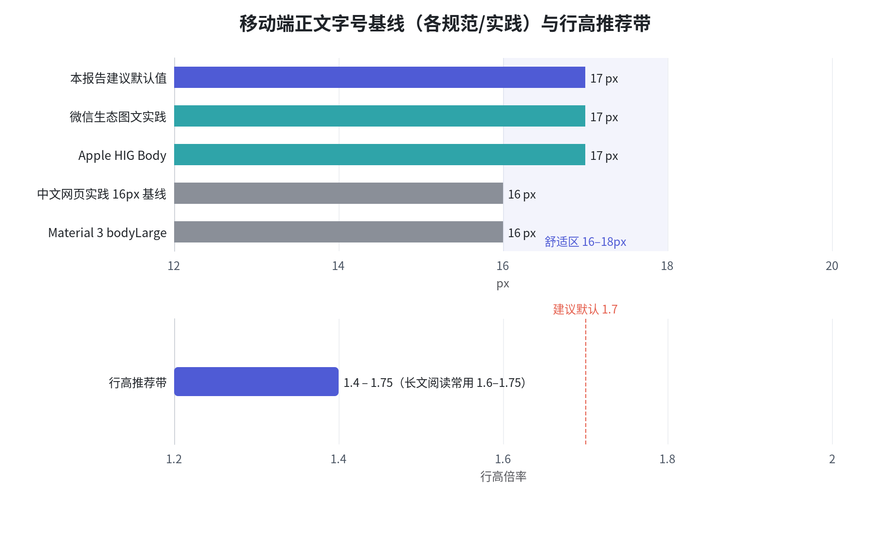
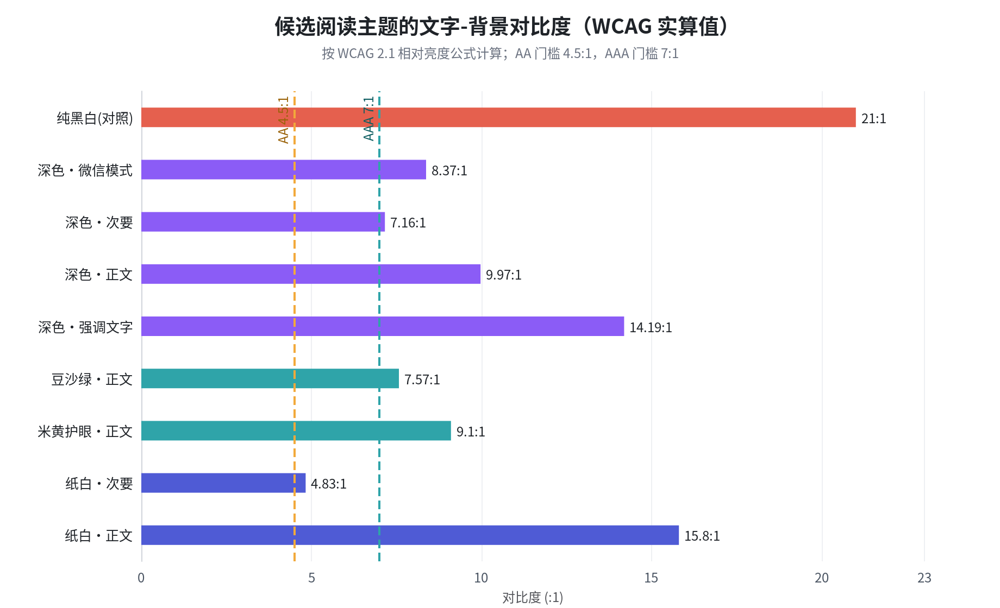
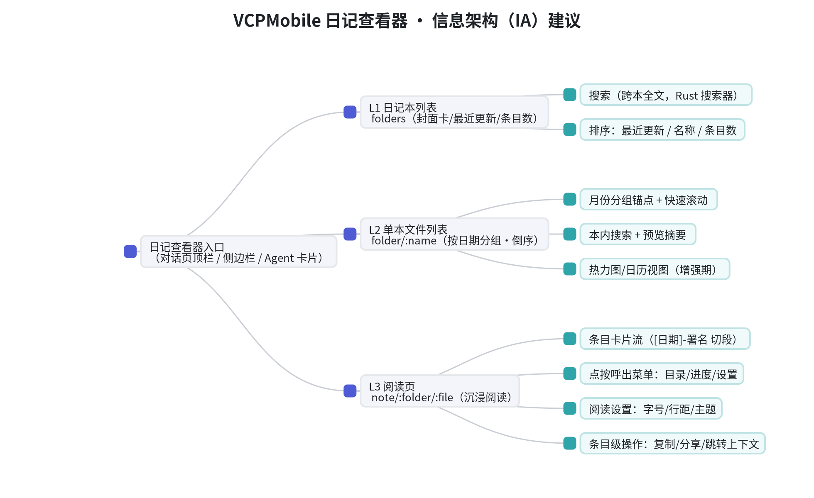
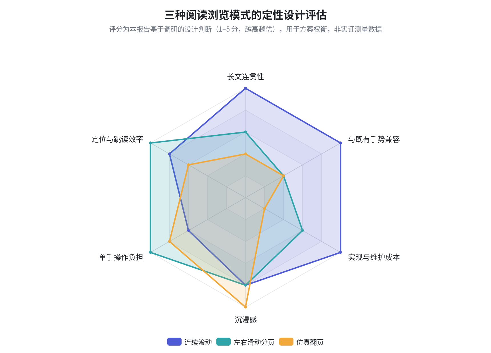
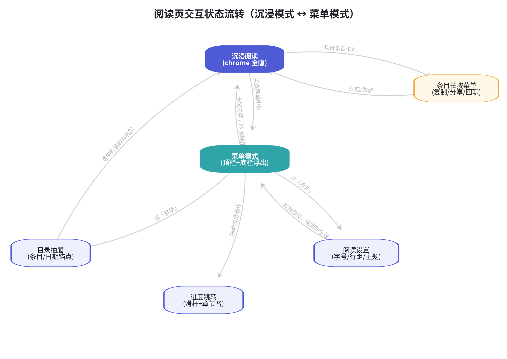
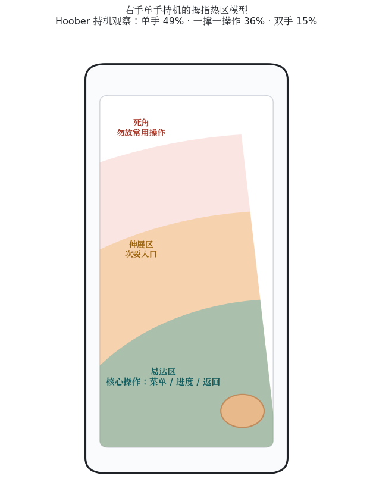

# VCPMobile 日记查看器：移动端排版与交互形式研究报告

> [!IMPORTANT]
> **文档状态：视觉研究附件，不是施工 SSOT。** 2026-08-12 的源码审计确认：真实管理模型是“文件夹 → memo 文件 → 整文件内容”，而非本文所述“日期文件 → 时间戳条目”；管理 API 还需要 Basic 管理员凭据，单文件 GET 也没有已证实的 1 MiB 上限。本次目标包含编辑，因此本文“排除编辑”的边界同样失效。请从 [README.md](./README.md) 进入当前 `01`—`06` 施工文档；本文的字号、行高和外部案例只作候选视觉素材，须服从新文档的事实与 UI 宪法。

> 研究对象：VCP 日记/知识库查看器（从后端接口获取）向 VCPMobile（Project Avatar）的移植
> 研究范围：仅限**排版（Typography）**与**交互形式（Interaction）**两大设计维度；技术栈与工程实现不作为约束
> 研究方法：VCP 生态源码直读 + 平台规范（Apple HIG / Material Design / WCAG）比对 + 主流阅读·笔记类 App 案例分析 + 定量测算（行长、对比度）

---

## 1. 摘要（TL;DR）

VCP 的日记与知识库在数据上是"**日记本（文件夹）→ 日期文件 → 时间戳条目**"的三级结构，后端 `dailyNotesRoutes.js` 已提供文件夹列表、文件列表、单文件读取与全文搜索等完整只读接口 [(Github)](https://github.com/FuHesummer/VCPtoolbox-Junior) 。这意味着移动端查看器的信息架构可以非常干净：**三级页面（日记本列表 → 文件列表 → 沉浸阅读页）+ 一个全局搜索**，恰好落在手机导航的甜蜜点上。

排版方面，各平台规范与中文实践高度收敛：正文 **16–17px**、行高 **1.6–1.75 倍**、每行 **18–26 个汉字**、左对齐不两端对齐、正文对比度 ≥ **4.5:1**（深色主题用 **#121212** 而非纯黑，文字用 87%/60% 透明度白） [(Worktile)](https://worktile.com/insights/z6btr6l2e0lur57ya1gnyt4s) 。交互方面，阅读页应采用"**连续滚动 + 点按中央呼出菜单**"的沉浸模型（微信读书/华为阅读同款），阅读器自身的翻页需求让位于滚动，把"翻页"语义降级为文件级切换；所有高频操作（菜单、进度、返回）必须落在拇指易达区——Hoober 的观察研究显示 **49%** 的用户单手持机，底部区域的首击准确率高达 **98%** [(Monterail)](https://www.monterail.com/blog/thumb-friendly-navigation-word-oriented-design) 。

报告最后给出一套可直接进入设计评审的**规格表**（字号字阶、间距 Token、主题色板、手势表、组件清单）与三期实施路线（MVP → 增强 → 回顾体系），可直接映射到 VCPMobile 现有的 SlidePage 虚拟导航、Semantic Z-Index 与 BottomSheet 体系 [(Github)](https://github.com/MRiecy/VCPMobile) 。

---

## 2. 需求界定：我们要移植的是什么

### 2.1 VCP 日记/知识库的数据形态与接口形态

在动手设计之前，必须先把"日记查看器"的原材料摸清楚。VCPToolBox 的日记体系由 DailyNote 插件套件（Write / Manager / Panel / Editor）生产：AI 按 `<<<DailyNoteStart>>>` 协议块输出日记，含 `Maid`（角色）、`Date`、`Tags`、`Content` 四个字段，最终落盘为 `dailynote/<日记本名>/<日期>.txt` 的纯文本文件 [(zhichai.net)](https://zhichai.net/topic/177169597) 。知识库（`knowledge/` 与 `Agent/<名>/knowledge/`）与日记共享同一套文件组织逻辑，而后端路由 `dailyNotesRoutes.js` 是通用化的——它提供文件夹列表、单文件夹文件列表、单文件读写、批量删除、移动、全文搜索与联想发现等端点，并内置路径穿越防护与写队列 [(Github)](https://github.com/FuHesummer/VCPtoolbox-Junior) 。仓库中的示例日记进一步确认了文件内格式：`[日期] - 署名` 作为条目头，下面跟一段正文，一天一个文件，同一文件内可有多条条目。

这一数据形态对设计有三个直接推论。其一，**层级天然是三级**：日记本 → 文件 → 条目，不需要桌面端那种多窗格并置，手机上逐级下钻即可。其二，**单文件有大小上限**（读取上限 1 MB 量级），极端长文需要在阅读页做分段渲染，但绝大多数日记文件只有几 KB 到几十 KB，可以一次性取回。其三，**搜索是后端能力而非前端负担**：`GET /search` 支持多关键词全文检索，配合 Rust 实现的记忆检索引擎（官方宣称十万级标签下毫秒级延迟） [(Github)](https://github.com/lioensky/VCPToolBox) ，移动端只需要做好搜索框、结果列表与高亮定位。VCPMobile 侧早已建立与 VCP 服务器的直连通道（用户在引导流程中配置服务器地址与 API Key） [(Github)](https://github.com/MRiecy/VCPMobile) ，因此"从后端接口网络获取"在链路上没有障碍，真正的设计问题只剩下一个：**取回来之后，怎么排、怎么读、怎么用**。

### 2.2 VCPMobile 已有的设计资产（本次移植的"地基"）

VCPMobile（Project Avatar）并不是一张白纸。它已经有 11 级语义化 Z-Index 体系（`content` 到 `gate`）、SlidePage 虚拟页面栈（非路由跳转、动态层级、物理返回键 LIFO 消费）、BottomSheet/Dialog/Viewer 等全套浮层原语、UnoCSS 原子样式与主题系统（含跟随系统的深色模式）、18 个 Composition API 风格的 Pinia Store，以及侧边栏手势、长按、滑动卡片等手势惯例 [(Github)](https://github.com/MRiecy/VCPMobile) 。日记查看器的所有设计决策都应当**复用这套既有语言**，而不是发明第二套：阅读页进 SlidePage 栈（`page` 层，40+），阅读设置走 BottomSheet（`sheet` 层，50），条目长按菜单走 ContextMenu（`dialog` 层，60），图片查看走 AttachmentViewer（`viewer` 层，70）——层级语义与既有规范一一对应 [(Github)](https://github.com/MRiecy/VCPMobile) 。

同样重要的是项目的"宪法"：Magi 三贤者协议要求任何功能都要同时通过逻辑（Melchior）、美学直觉（Balthasar）与务实交付（Casper）的三方审查 [(Github)](https://github.com/MRiecy/VCPMobile) 。本报告的结构也呼应这一点：排版与交互的每一条建议都标注了依据来源（规范/研究/案例），并在落地章节给出 MVP 裁剪线，避免"过度设计"被 Casper 否决。此外，VCPChat 桌面端已经实现了日记渲染与知识库管理界面，移动端不是照抄桌面端的信息密度，而是继承其"条目化"心智——把日记从"一坨 txt"变成"可浏览、可定位、可回顾"的内容流。

### 2.3 设计目标与研究问题

用户给出的目标非常明确：**让手机用户真正用起来方便、看起来美观**。把这句话拆成可验证的研究问题，就是本报告后面三章要回答的六个问题：正文该多大、行该多松（3.1–3.2）；中文特有的对齐与标点问题怎么处理（3.3）；深色模式怎么既护眼又达标（3.4）；三级内容如何组织导航、阅读页采用滚动还是翻页（4.1–4.3）；手势怎么和 VCPMobile 现有的边缘返回、抽屉手势共存（4.4）；以及日记这种"写给未来的自己"的内容，如何通过搜索与回顾设计释放第二生命（4.5）。所有的规范引用、案例证据与定量测算，最终都汇入第 5 章的规格表。

需要预先划定边界的是"不研究什么"。本报告不讨论后端接口的协议设计（现有 API 已够用）、不讨论编辑与创作功能（查看器定位是"读"，写入仍归对话场景与 DailyNote 插件体系 [(Github)](https://github.com/FuHesummer/VCPtoolbox-Junior) ）、不讨论桌面端的双栏/多窗格范式（手机没有空间余量，且官方桌面前端 VCPChat 走的高密度路线本就不适合照搬 [(Github)](https://github.com/lioensky/VCPToolBox) ）。同时明确衡量标准：每条设计建议必须能回答三个问题——依据是什么（规范/研究/案例）、成本是多少（MVP 是否值得）、是否伤害既有体验（与 VCPMobile 手势/层级/主题体系冲突与否）。这把"美观"从口味问题变成可评审的工程问题。

---

## 3. 排版研究：让 AI 日记在 6 英寸屏上"好读"

### 3.1 字号体系：以 16–17px 正文为锚点的字阶

移动端正文字号在三大权威来源里几乎重叠：Apple HIG 的 Dynamic Type 把 **Body 定为 17pt**（Large 默认档，Leading 22pt） [(codershigh.github.io)](https://codershigh.github.io/guidelines/ios/human-interface-guidelines/visual-design/typography/index.html) ；Material Design 把正文定为 14sp、列表项与"重要文本片段"定为 **16sp**，并解释列表项之所以更大是因为"每个词的重要性更高" [(Learn UI DesignLearn UI Design)](https://learnui.design/blog/android-material-design-font-size-guidelines.html) 。中文实践侧，公众号生态把 **16px 视为正文安全线**（低于 14px 在移动端"自寻死路"，大于 18px 显臃肿），15–17px 是主流区间 [(uecloud.com)](https://www.uecloud.com/geo/article/dz8) 。Apple 同时警告应避免 Ultralight/Thin/Light 字重用于正文，最小字号不得低于 11pt [(median.co)](https://median.co/blog/apples-ui-dos-and-donts-typography) 。日记是**长文本阅读场景**而非表单场景，因此建议锚定区间上沿：**正文默认 17px，可调范围 15–20px**。

围绕正文锚点，需要一整条字阶而不是单个数字。下表综合 HIG、Material 与中文实践给出建议字阶（Android dp ≈ px，160dpi 基准）：

| 角色 | 建议值 | 字重 | 依据 |
|---|---|---|---|
| 页标题（日记本名） | 22px | SemiBold | Material 页标题 20–22sp [(Learn UI DesignLearn UI Design)](https://learnui.design/blog/android-material-design-font-size-guidelines.html)  |
| 条目日期头（H1 等效） | 20px | SemiBold | HIG Title 3 为 20pt [(codershigh.github.io)](https://codershigh.github.io/guidelines/ios/human-interface-guidelines/visual-design/typography/index.html)  |
| 小节标题（H2/H3 等效） | 18px | Medium | 中文层级实践 [(uecloud.com)](https://www.uecloud.com/geo/article/dz8)  |
| **正文** | **17px（15–20 可调）** | Regular | HIG Body 17pt；中文安全线 [(codershigh.github.io)](https://codershigh.github.io/guidelines/ios/human-interface-guidelines/visual-design/typography/index.html)  |
| 辅助/元信息（时间、标签） | 13px | Regular | HIG Footnote 13pt [(codershigh.github.io)](https://codershigh.github.io/guidelines/ios/human-interface-guidelines/visual-design/typography/index.html)  |
| 图注/角标 | 12px | Regular | HIG Caption 12pt [(codershigh.github.io)](https://codershigh.github.io/guidelines/ios/human-interface-guidelines/visual-design/typography/index.html)  |
| 绝对下限 | 11px | — | Apple 最小字号红线 [(median.co)](https://median.co/blog/apples-ui-dos-and-donts-typography)  |

字阶管理的另一个要点是**克制层级数量**。同一页面不要使用超过 3 种字重，正文 Regular（400）+ 标题 SemiBold（600）即可覆盖日记场景的 90% 需求 [(CSDN博客)](https://blog.csdn.net/gitblog_01118/article/details/160650323) 。VCPMobile 使用 UnoCSS，建议把这条字阶固化为语义化快捷类（如 `text-diary-body`、`text-diary-h1`），与主题 Token 一起注入，避免各页面手写魔法数字——这与项目已有的 Semantic Z-Index"消灭 z-[999]"的治理思路一脉相承 [(Github)](https://github.com/MRiecy/VCPMobile) 。

字号调节机制本身也值得设计。iOS 的 Dynamic Type 提供了 xSmall 到 xxxLarge 共 7 档正文尺寸（Body 从 14pt 平滑延伸到 23pt），外加 5 档无障碍超大字号，其哲学是"让系统记住用户的阅读偏好" [(codershigh.github.io)](https://codershigh.github.io/guidelines/ios/human-interface-guidelines/visual-design/typography/index.html) 。Android 侧没有同等级的全局机制，因此阅读类 App 普遍在 App 内自建字号调节——这正是本报告建议的"15–20px 六档滑杆"。两个细节决定体验好坏：其一，**调节必须实时预览**（在设置面板背后直接看到正文变化），而不是保存后返回才生效；其二，**只缩放正文与标题，不缩放 UI chrome**——HIG 在响应字号变化时明确建议"优先内容"，用户调大字号是为了看清内容，不是为了让按钮也变得巨大 [(codershigh.github.io)](https://codershigh.github.io/guidelines/ios/human-interface-guidelines/visual-design/typography/index.html) 。这一条能避免许多阅读器"大号字配大按钮"的滑稽局面。

### 3.2 行高、行长与竖向节奏

行高是中文阅读舒适度的第一变量。中文方块字信息密度高、无词间空格，行距不足会产生"糊墙感"。综合来源：中文正文舒适行高集中在 **1.6–1.8 倍**（16px × 1.75 = 28px 是被反复引用的黄金组合） [(CSDN博客)](https://blog.csdn.net/2301_76428778/article/details/160663669) ；WCAG 1.4.12 给出无障碍下限——行高 ≥ 1.5 倍、段间距 ≥ 2 倍字号、字间距 ≥ 0.12 倍字号 [(Github)](https://github.com/davila7/claude-code-templates/blob/main/cli-tool/components/skills/creative-design/mobile-design/mobile-typography.md) 。移动端长文阅读普遍取区间上沿，微信生态实践甚至用到 1.75–2.0 倍 [(uecloud.com)](https://www.uecloud.com/geo/article/ZAkR) 。**建议日记正文默认行高 1.75，可调档 1.5 / 1.6 / 1.75 / 1.9**。按此计算，17px × 1.75 ≈ 29.8px 行高，一屏（内容区约 740dp）约容纳 25 行——正好是一段沉浸阅读而不压抑的密度（本报告测算）。

行长（每行字数）容易被忽视，但它决定了"回行找行"的疲劳度。中文排版基线给出的建议是：Web 单栏 28–38 字/行，**移动端 18–26 字/行** [(Worktile)](https://worktile.com/insights/z6btr6l2e0lur57ya1gnyt4s) 。本报告对常见 Android 逻辑宽度做了测算（每行字数 =（屏宽 − 2×页边距）÷ 字号）：

| 设备（逻辑宽） | 页边距 | 15px | 17px | 20px |
|---|---|---|---|---|
| 小屏 360dp | 16dp | 21.9 字 | 19.3 字 | 16.4 字 |
| 主流 393dp | 16dp | 24.1 字 | 21.2 字 | 18.1 字 |
| 大屏 412dp | 20dp | 24.8 字 | 21.9 字 | 18.6 字 |
| 折叠展开 600dp | 24dp | 36.8 字 | 32.5 字 | 27.6 字 |

结论很清晰：**手机竖屏在 16–20dp 页边距、15–20px 字号下，每行恰好落在 18–26 字的舒适区**，不需要额外干预；但折叠屏/平板展开后行长会冲到 30 字以上，此时应给阅读栏设 `max-width`（约 34em）居中，而不是放任文字铺满全宽（本报告测算，依据行长建议 [(Worktile)](https://worktile.com/insights/z6btr6l2e0lur57ya1gnyt4s) ）。

竖向节奏上，移动端段落应"短而透气"：单段不超过 5 行，段间距取 0.8–1 倍行高（约 15–20px），用**段间距而非首行缩进**分隔段落——段距与首行缩进二选一，避免视觉冲突 [(Worktile)](https://worktile.com/insights/z6btr6l2e0lur57ya1gnyt4s) 。AI 日记天然是短段落（通常 2–6 句一段），配合条目卡片的分割（见 4.3），竖向节奏会比传统网文更松弛。

### 3.3 中文排版细节：对齐、标点与段落形态

**对齐方式是中文移动端最大的隐形坑。** 印刷品习惯两端对齐（justify），但在手机窄栏 + 大字号的条件下，两端对齐会在行内产生不均匀的空白拉伸（"河流效应"），而中文浏览器/渲染引擎缺少英文的断词（hyphenation）机制，拉伸全部落在字间距上，观感更糟。排版基线明确建议：移动端**左对齐，禁用两端对齐**，保留自然断词规则；两端对齐只属于印刷品场景（且需配合连字优化） [(Worktile)](https://worktile.com/insights/z6btr6l2e0lur57ya1gnyt4s) 。这一点与许多公众号排版教程的"正文两端对齐"经验相悖，但后者的前提是 15px 小字号 + 固定栏宽，日记查看器提供用户可调字号，一旦用户调到 19–20px，两端对齐的河流效应会非常明显——**左对齐是唯一稳妥解**。

标点细节决定"精致感"上限，建议纳入渲染层规范：

| 细节 | 建议 | 说明 |
|---|---|---|
| 避头尾 | 开启 | 句号、逗号、闭括号不置行首；开括号不置行尾 |
| 标点悬挂 | 开启（视觉对齐） | 行首引号/书名号半角悬挂，保持文字边缘整齐 |
| 中西文混排 | 自动加 1/4em 空隙 | "VCP 日记"优于"VCP日记"，引擎层处理 |
| 数字与单位 | 半角数字 | 与全角汉字混排时保持计量一致 [(Worktile)](https://worktile.com/insights/z6btr6l2e0lur57ya1gnyt4s)  |
| 省略号/破折号 | 占两字宽不折行 | ……与——不拆到两行 |
| 斜体 | 中文禁用 | 斜体降低中文可读性，强调用加粗或变色 [(Worktile)](https://worktile.com/insights/z6btr6l2e0lur57ya1gnyt4s)  |

这些规则在 Web 渲染层多半可由 CSS（`text-spacing`、`hanging-punctuation` 的渐进支持）加少量后处理实现，工程成本不高，但对"看起来美观"的贡献是肉眼可见的——尤其是标点悬挂，它是区分"系统默认渲染"与"专业阅读器"的最直观标志。

### 3.4 深色模式与阅读主题：对比度的定量权衡

VCPMobile 的主题系统已支持跟随系统深色模式 [(Github)](https://github.com/MRiecy/VCPMobile) ，但"通用 UI 深色"与"长文阅读深色"不是一回事。Material 深色主题的核心规范是：背景用 **#121212** 而非纯黑（纯黑 #000 与纯白文字形成 21:1 极端对比，产生"光晕/halation"——文字像在黑底上渗开、令眼睛疲劳，OLED 上还会拖影） [(Acodez)](https://acodez.in/dark-mode-ui-ux-designing/) 。文字不用纯白，而用**透明度分级的白——高强调 87%、中强调 60%、禁用 38%** [(Acodez)](https://acodez.in/dark-mode-ui-ux-designing/) 。层级（elevation）不靠阴影，而靠**白色覆盖层递亮**（卡片 +5%、弹层 +8–11%、模态 +12–16%） [(xsoneconsultants)](https://xsoneconsultants.com/blog/dark-mode-ui-design-best-practices/) 。强调色降饱和 10–20%，避免在暗底上"霓虹化" [(UXPin)](https://www.uxpin.com/studio/blog/dark-mode-benefits/) 。OLED 设备上深色主题还能实打实省电（满亮度最高约 67%，30% 亮度约 14%） [(bricxlabs.com)](https://bricxlabs.com/blogs/message-screen-ui-deisgn) 。

本报告按 WCAG 2.1 相对亮度公式，对四套候选阅读主题做了对比度实算（AA 门槛 4.5:1，AAA 门槛 7:1 [(Recite Me)](https://reciteme.com/news/wcag-contrast-ratio-4-5-1/) ）：

| 主题 | 文字/背景 | 对比度（实算） | 判定 |
|---|---|---|---|
| 纸白 | #1F2328 / #FFFFFF | **15.80:1** | AAA |
| 米黄护眼 | #4A3B2A / #F5EBD7 | 9.10:1 | AAA |
| 豆沙绿护眼 | #374238 / #CCE0CF | 7.57:1 | AAA |
| 深色（Material 式） | 白 87% / #121212 | **14.19:1** | AAA |
| 深色·低刺激（微信式） | #B2B2B2 / #181818 | 8.37:1 | AAA |
| 纯黑白（对照组） | #FFFFFF / #000000 | 21.00:1 | 数值最高但**应避免**（光晕） |

数据支持两个设计决策。第一，**阅读器的深色主题可以放心把正文对比度从 21:1 降到 8–15:1 区间**，全部仍达 AAA，却显著降低夜间刺激——这与主流实践"正文 4.5:1 达标即可、长阅读建议 12:1 上下"完全一致 [(Anonymous Design)](https://anonymous.com.sg/why-dark-mode-ui-isnt-just-an-aesthetic-choice-plus-implementation-tips/) 。第二，护眼主题（米黄/豆沙绿）不是玄学，两者都过 AAA，可以作为阅读设置的常备皮肤。建议阅读主题定为四档：**纸白 / 米黄 / 豆沙绿 / 深色**，与 VCPMobile 全局主题解耦——用户完全可以 UI 用深色、阅读用米黄，这是阅读类产品的惯例（主题只影响阅读页内容区，不影响全局 chrome）。

工程上，主题应当落地为**语义化 Design Token 而非硬编码色值**：`color-surface-primary` 在浅色解析为 `#FFFFFF`、在深色解析为 `#1E1E1E`，组件只引用语义名，切换主题即全局换肤且无需逐组件修补 [(UXPin)](https://www.uxpin.com/studio/blog/dark-mode-benefits/) 。成熟的深色 token 架构通常包含背景、表面、主色（深色下降饱和提亮度，如 `#1976D2` → `#64B5F6`）、三级文字（87%/60%/38% 透明度白）与四档 elevation 色阶 [(Sanjay Dey)](https://www.sanjaydey.com/mobile-ux-ui-design-patterns-2026-data-backed/) 。还有两个容易踩的坑：OLED 屏幕上纯黑背景在滚动时会产生"拖影（smearing）"，这是除光晕外第二个避免纯黑的理由 [(usevisuals.com)](https://usevisuals.com/blog/optimizing-dark-mode-social-media-graphics) ；图片在深色下可能过亮刺眼，必要时加一层 85–90% 不透明度的压暗遮罩 [(UXPin)](https://www.uxpin.com/studio/blog/dark-mode-benefits/) 。VCPMobile 的主题系统本就是 CSS 变量注入式 [(Github)](https://github.com/MRiecy/VCPMobile) ，按语义 token 扩展阅读主题几乎是顺水推舟。

### 3.5 日记内容元素的手机适配

VCP 日记正文以纯文本为主，但知识库文件与"富日记"中会出现 Markdown 元素。移动端适配的核心原则是**收敛而非复刻桌面渲染**：标题层级在手机上最多呈现三级（H1=20 / H2=18 / H3=17 加粗），更深的标题一律按 H3 渲染，否则窄屏上层级反而不可辨。代码块是最容易破坏排版的元素——长行代码在 360dp 屏上必须二选一：**横向滚动（保真）或软换行（保读）**。排版基线的建议是为代码块与长表格提供**可横向滚动的独立容器**，必要时折叠，绝不破坏整页行长与网格 [(Worktile)](https://worktile.com/insights/z6btr6l2e0lur57ya1gnyt4s) ；报告建议默认软换行 + 右上角"横滚开关"，因为 AI 日记里的代码多为片段而非需要对齐的表格代码。等宽字体缩小到正文的 0.85 倍（约 14.5px），保证密度。

其余元素的处置建议如下表：

| 元素 | 移动端处置 |
|---|---|
| 表格 | 默认转为"卡片式键值列表"；列数 ≤3 且内容短时保留表格，容器可横滑 [(Worktile)](https://worktile.com/insights/z6btr6l2e0lur57ya1gnyt4s)  |
| 图片 | 宽度撑满内容栏、圆角 8px、点击进 AttachmentViewer（z-viewer 层） [(Github)](https://github.com/MRiecy/VCPMobile)  |
| 引用块 | 左侧 3px 竖条 + 缩进 + 降一级字色，多层嵌套只呈现两层 |
| 列表 | 无序列表统一 •，缩进 1.2em，行高与正文一致 [(uecloud.com)](https://www.uecloud.com/geo/article/ZAkR)  |
| 分割线 | 降级为 32px 竖向留白，不再画横线（留白即分隔） |
| 链接 | 下划线 + 主题色，与"加粗强调"严格区分 [(Worktile)](https://worktile.com/insights/z6btr6l2e0lur57ya1gnyt4s)  |
| LaTeX 公式 | 行内公式随文渲染；块级公式可横向滚动，不做缩放 |

这套处置背后有一条统一逻辑：**凡是二维结构（代码、表格、公式），在手机上要么降维（卡片化、软换行），要么关进容器（横滚），绝不允许它们把正文栏宽顶破**。栏宽一旦不稳定，3.2 节精心维护的行长与竖向节奏就全部失效。对 VCP 日记而言好消息是绝大多数内容就是纯文本段落，Markdown 元素主要出现在知识库文件里，因此这套规则是为"上限情况"兜底，而不是日常负担——MVP 阶段只需实现标题、列表、引用、代码块四项，其余可按内容实际情况渐进补齐。

### 3.6 字体与字重：系统栈优先，宋体点睛

字体选择上，移动端阅读器的稳妥路线是**正文用系统无衬线栈**（Android 的 Noto Sans CJK / 厂商黑体，iOS 的 PingFang SC），理由是屏读清晰度、零加载成本与跨设备一致性——通用字体确保不同设备显示一致，冷门字体一旦加载失败排版即崩盘 [(elurens.com)](https://www.elurens.com/baiduyouhua/30617.html) 。无衬线黑体也是屏幕阅读的主流建议，衬线体更适合印刷长文 [(Worktile)](https://worktile.com/insights/z6btr6l2e0lur57ya1gnyt4s) 。字重方面沿用 3.1 的纪律：正文 Regular、标题 SemiBold，**避免 Light 及以下字重用于正文**（细字在小屏上发虚，Apple 明确不建议） [(median.co)](https://median.co/blog/apples-ui-dos-and-donts-typography) ；深色模式下由于"光渗错觉"（浅字在暗底上视觉显粗），正文同样维持 Regular 即可，无需加粗补偿 [(xsoneconsultants)](https://xsoneconsultants.com/blog/dark-mode-ui-design-best-practices/) 。

但日记是值得一点"书卷气"的场景。主流中文阅读器（微信读书、掌阅等）都提供宋体选项，因为宋体的衬线气质天然唤起"读书"的心智。建议字体设置提供两档：**默认黑体**（系统栈）与**宋体**（思源宋体 CN，开源免费、含 7 种字重） [(CSDN博客)](https://blog.csdn.net/gitblog_01118/article/details/160650323) 。宋体的引入要注意三件事：其一，按需加载且优先加载 Regular 字重，其余字重延迟加载，并设置 `font-display: swap` 避免字体到达前的布局偏移与 invisible text [(CSDN博客)](https://blog.csdn.net/gitblog_00781/article/details/160356828) ；其二，中文字体必须做子集化（subset），完整中文字体约 3MB，子集化后可压到 300KB 量级 [(ttmoban.com)](http://ttmoban.com/7348.html) ；其三，回退链必须完整（宋体 → 系统宋体 → 系统黑体），任何一环失败都不能影响可读性。标题与 UI 永远保持黑体——宋体只作用于日记正文，这是"内容区个性化、chrome 中立化"的边界。

---

## 4. 交互研究：三级结构如何在单手时代"好用"

### 4.1 信息架构与导航入口

日记查看器的 IA 可以直接映射数据的三级结构，这是它最大的幸运——不需要发明导航，只需要**诚实地下钻**：

真正需要决策的是**入口位置**。VCPMobile 的主界面是对话页（侧边栏为 Agent 列表），日记查看器作为一级新功能，有三种候选入口：

| 入口方案 | 发现性 | 评价 |
|---|---|---|
| 对话页顶栏图标（日记/书架） | 高 | 始终可见，一步直达，推荐主入口 |
| Agent 卡片长按/滑出「日记」 | 中高 | 情境化极强——"看这个 Agent 的日记"，推荐保留 |
| 侧边栏底部固定项 | 中 | 藏在抽屉里，发现性打折 |

这里有一条硬证据：导航模式的对比研究显示，把核心功能从汉堡菜单/抽屉迁移到**可见的 Tab/入口后，用户会话数与功能发现率提升 30% 以上** [(Appy Pie)](https://www.appypie.com/blog/app-navigation-patterns) ；"Out of sight, out of mind"是抽屉导航的系统性缺陷，它只适合次级功能 [(UI UX News - Learn User Interface Design)](https://uiuxnews.in/menu-driven-interface-navigation-best-practices/) 。可见性优势之外还有熟悉度优势——Jakob 定律指出用户把大量时间花在其他应用里，他们会带着 Instagram、Spotify 等主流 App 养成的导航预期来用你的 App，可见式底部/顶栏入口正是这种被反复强化的范式 [(bestlyfegroup.com)](https://bestlyfegroup.com/blog/website-design/thumb-friendly-navigation-placement-ergonomic-design-for-mobile-screens/) 。因此建议采用"**顶栏图标（全局）+ Agent 卡片情境入口（定向）**"的双入口：前者进日记本总列表，后者直接过滤到该 Agent 的日记本。查看器内部的三级页面全部走 SlidePage 虚拟栈，物理返回键按 LIFO 逐层回退——与 Operation Aegis 的既有行为完全一致 [(Github)](https://github.com/MRiecy/VCPMobile) 。

三级页面内部各自扁平：L1 日记本列表（顶部搜索 + 排序），L2 单本文件列表（按月份分组的倒序时间流 + 本内搜索），L3 阅读页。不引入第四级；标签（Tags）不作为独立层级，而作为 L1/L2 的筛选 chips——VCP 日记自带 Tags 字段 [(zhichai.net)](https://zhichai.net/topic/177169597) ，标签筛选是低成本高回报的组织维度。

### 4.2 列表层：日记本与文件的浏览形态

**L1 日记本列表**是门面，建议卡片化：每个日记本一张卡，显示日记本名、条目/文件数、最近更新时间与最新一条日记的首行摘要。卡片比纯列表多付出的高度成本，换来的是"每本日记有个性"的情感连接——这对日记场景至关重要（这些日记本在 VCP 里本来就是不同 Agent 的"人格记忆"）。排序默认"最近更新"，可选"名称/条目数"；顶部常驻搜索框（进入 4.5 的全局搜索）。若日记本数量多（重度用户可达几十本），列表项需要图片或色块时，记得 Obsidian 移动端的教训：底部导航 + 手势抽屉是移动端工作区的标准解法，所有高频功能必须在两次点按内到达 [(Obsidian Help)](https://help.obsidian.md/workspace) 。

**L2 文件列表**是时间流：按日期倒序、按月份分组锚点（类似系统相册的月份标题），每行显示日期（`2025.04.25`）+ 当日条目数 + 首条目摘要。这里有两个细节决策。其一，**月份分组锚点 + 右侧月份快速滚动条**比纯平列表更高效，因为日记的核心定位维度就是时间；其二，摘要只取首条目前两行（约 40 字），超出截断——摘要的使命是"唤起记忆"，不是"代替阅读"。文件数量上，一个活跃日记本一年可积累 300+ 个日期文件，一次性取回文件列表没有网络压力（文件名+元数据极小），但渲染应上**虚拟列表**（见 4.6）。

列表页的顶栏结构可以参照 Obsidian 移动端 1.4 版改版的成熟做法：手机版把核心导航收成**底部导航栏 + 前进/后退箭头 + 可自定义的快捷动作菜单**，并为上下文菜单与下拉菜单加入触觉反馈（haptic feedback） [(Obsidian)](https://obsidian.md/changelog/2022-10-26-mobile-v1.4.1/) 。对 L2 而言，这意味着顶栏只需保留返回、日记本名、搜索三件套，排序与视图切换收进"更多"菜单；长按列表行弹出快捷操作（置顶该日期、分享当日）时给一次轻震动，让操作有"确认感"。触觉反馈是移动端交互里最便宜的质感来源，Obsidian 将其纳入正式改版项绝非偶然 [(Obsidian)](https://obsidian.md/changelog/2022-10-26-mobile-v1.4.1/) 。

**空态与引导**也在这一层设计：日记本为空时显示"这本日记还没有写下第一页"+ 回到对话页的引导按钮（日记由 AI 在对话中写下，查看器本身不承担创建职责——这是查看器与 flomo 类工具的本质区别，输入摩擦不属于本功能的设计域 [(少数派)](https://sspai.com/post/64009) ）。

### 4.3 阅读页：滚动优先的沉浸模型

阅读页是本报告的"主战场"。先回答最关键的模式之争：**连续滚动 vs 左右翻页 vs 仿真翻页**。

主流阅读器确实提供全家族翻页方式——华为阅读支持仿真、横滑、双翻页、上下滑动、无动效乃至眼动翻页、自动翻页、音量键翻页 [(Huawei Consumer)](https://consumer.huawei.com/cn/support/content/zh-cn16029840/) ——但那是**书籍场景**：一本书几十万字，需要"页"作为稳定的定位锚。VCP 日记完全不同：单文件通常一两千字，最长的月份文件也不过几万字，定位靠"日期条目"而非"页码"。连续滚动在长文连贯性、与既有手势兼容（不占用左右滑动）、实现成本上全面占优；仿真翻页的沉浸感加分项，在日记场景被条目卡片的分隔感替代了。**结论：阅读页默认且仅需连续滚动**；"上一日/下一日"的文件级切换提供顶栏箭头与底部悬浮条即可，不做文件内的翻页动画。这条结论把工程从"分页引擎"中解放出来，也消灭了与边缘返回手势的最大冲突源（详见 4.4）。

滚动模型确定后，阅读页的交互骨架是业界高度验证的"**沉浸模式 ↔ 菜单模式**"双态：

- **沉浸模式**（默认）：隐藏顶栏与系统 chrome，只保留内容与右下角迷你进度环。滚动即阅读。
- **菜单模式**：**点按屏幕中央**呼出（点按左/右 1/4 区域不做任何事，避免误触；经典电纸书模型是左右点按翻页、中央呼出菜单 [(iflyink.com)](http://download.iflyink.com/智能笔记本青春版T1使用手册.pdf) ，我们既然不用翻页，就把左右区域留空）。顶栏浮出：返回、文件名、搜索（本文件内）、更多；底栏浮出：目录（条目锚点）、进度滑杆、上一日/下一日、版式设置。3 秒无操作或点按内容区自动回落沉浸模式。
- **目录抽屉**：左边缘滑出或底栏「目录」呼出，列出本文件的条目头（`[日期] - 署名` 切段），点选即滚动锚定并收起——这就是日记场景的"章节目录"。
- **进度**：进度滑杆拖动时浮显当前位置对应的条目日期（"4月25日 · 第3条"），而不是抽象的百分比——日期才是日记的定位语义。
- **条目卡片**：每条日记（条目头 + 正文）渲染为一张卡片，卡片间距 12px、卡内边距 16px。长按卡片弹出 ContextMenu（z-dialog 层）：复制该条、分享为图片/文本、"回到相关对话"（若同步数据可定位当日对话上下文）。条目级操作是日记区别于小说的核心交互——**日记的颗粒是"条"，不是"页"**。

单手场景还有一个可选项值得记录。华为阅读的"单手模式"开启后，**点击屏幕左右两侧都翻到下一页**（右滑仍翻上一页），其洞察是：单手用户 80% 的翻页动作都是"下一页"，让最大面积的屏幕区域服务于最高频动作 [(Huawei Consumer)](https://consumer.huawei.com/cn/support/content/zh-cn16029840/) 。在我们的滚动模型下，对应物是"**点按屏幕下半部 = 滚动一屏**"的可选开关（默认关闭）：开启后整个下半屏成为巨大的"继续读"按钮，上半屏点按回滚一屏，中央仍呼出菜单。这给通勤单手持机的用户一个零瞄准成本的阅读节奏，而把选择权交给用户也符合阅读器"翻页方式全家福"的行业惯例 [(Huawei Consumer)](https://consumer.huawei.com/cn/support/content/zh-cn16029840/) 。

### 4.4 手势体系与冲突管理

手势设计的第一原则是**不与系统、不与 VCPMobile 既有手势打架**。先盘点既有手势资产：App 根布局有侧边栏手势（Agent 列表抽屉）、Agent 卡片支持左滑与长按、物理返回键走模态栈 LIFO [(Github)](https://github.com/MRiecy/VCPMobile) ；Android 系统侧有左/右边缘返回手势。阅读页又天然想要"左右滑做点什么"。冲突管理矩阵如下：

| 手势 | 在阅读页的行为 | 冲突与裁决 |
|---|---|---|
| 上下滚动 | 阅读主线 | 无冲突 |
| 点按中央 | 沉浸 ↔ 菜单切换 | 无冲突 |
| 点按左右 1/4 | 无行为（防误触） | 主动留白 |
| 左边缘滑动 | 系统返回（= 返回 L2） | 不让渡给 App，符合 Android 惯例 |
| 右边缘滑动 | **不使用** | 避免与系统返回（右手机型）及既有抽屉手势冲突 |
| 条目长按 | 条目 ContextMenu | 与既有长按惯例一致 [(Github)](https://github.com/MRiecy/VCPMobile)  |
| 双指捏合 | 不做字号缩放 | 缩放是设置项而非手势，避免与图片查看冲突 |
| 音量键 | 可选开启"滚动一页" | 阅读器惯例功能 [(Huawei Consumer)](https://consumer.huawei.com/cn/support/content/zh-cn16029840/) ，默认关 |

拇指热区是手势之外的静态约束。Steven Hoober 在 2012–2013 年对 1333 名移动用户的街头观察确立了经典分布：**单手 49%、一撑一操作 36%、双手 15%；全部交互中 75% 由拇指完成** [(Monterail)](https://www.monterail.com/blog/thumb-friendly-navigation-word-oriented-design) 。后续量化研究进一步给出三区的首击准确率：**易达区（底部）约 98%、伸展区（中部）85–90%、死角（顶部两角）仅 65–75%**；底部导航拿走了 70–80% 的导航点击 [(UX/UI Principles)](https://uxuiprinciples.com/en/principles/mobile-navigation-hierarchy) 。

热区模型在使用时要避免两个误读。其一，Hoober 本人后来修正过早期示意图的过度简化：**用户看与触最频繁、最准确的其实是屏幕中心**，而不是只有底部弧线区——正确的设计推论是"重要操作放在中下部带状区域"，而不是把所有东西都堆到最底边 [(Discovered Labs)](https://discoveredlabs.com/blog/mobile-conversion-rate-optimization-a-playbook-for-marketing-leaders) 。其二，热区是**镜像的**：右利手的热区翻转后才是左利手的热区，而约 33% 的单手操作用的是左手（用户会随情境换手），因此对称布局（底栏均分、中央呼出）天然比偏侧布局稳健 [(Parachute Design Group Inc.)](https://parachutedesign.ca/blog/thumb-zone-ux/) 。这两条修正恰好支撑了我们阅读页的选择：菜单中央呼出、底栏四键均分，既不赌左右手，也不赌握姿。

落到阅读页的具体规则：**菜单模式的底栏（目录/进度/版式）必须在易达区**；顶栏只放低频的返回与更多；进度滑杆的触控热区做到 48dp 高（Android 触控目标下限 48×48dp，iOS 44×44pt，元素间距 ≥8dp [(Boundev)](https://www.boundev.com/blog/mobile-app-design-best-practices) ）；条目长按菜单（ContextMenu）弹出位置跟随按点、但整体上移到底部半屏——绝不让用户在菜单模式和死角之间来回伸手。所有触控目标遵守 44–48dp 红线，过小的目标是误触与挫败感的第一来源 [(Boundev)](https://www.boundev.com/blog/mobile-app-design-best-practices) 。

### 4.5 搜索与回顾：日记的第二生命

VCP 日记区别于普通笔记的本质是：**它是 AI 写给"未来的自己"与用户的内容**，"读新"之外还有巨大的"重读"价值。flomo 的产品哲学极具参考价值——它把"回顾体系"置于与记录同等重要的位置：每日回顾推送、随机漫步、GitHub 贡献墙式的热力图量化记录成就感 [(少数派)](https://sspai.com/post/64009) 。日记查看器的搜索与回顾设计建议分三层。

**第一层：全文搜索（MVP 必备）。** 入口在 L1 顶部常驻 + L2/阅读页顶栏各一次。后端 `/search` 已支持多关键词全文检索 [(Github)](https://github.com/FuHesummer/VCPtoolbox-Junior) ，前端做好三件事：输入防抖（300ms）、结果按"日记本 → 文件 → 命中条目"三级聚合展示、命中词高亮。点结果直达阅读页对应条目锚点并短暂闪烁高亮（1.2s 呼吸高亮），完成"搜索 → 定位 → 阅读"的闭环。

**第二层：筛选与漫游（增强期）。** Tags 筛选 chips（日记协议原生带 Tags [(zhichai.net)](https://zhichai.net/topic/177169597) ）、日期区间筛选、以及一个"**随机漫步**"按钮——随机打开一条历史日记。随机漫步的成本几乎为零，却是日记产品里最被喜爱的"惊喜机制" [(少数派)](https://sspai.com/post/64009) 。

**第三层：回顾体系（远期，与同步/通知能力结合）。** "那年今日"卡片（展示历年同日的日记）、记录热力图（L1 顶部的小日历墙，直观看到哪个 Agent 哪天写了日记） [(少数派)](https://sspai.com/post/64009) 、每日回顾推送（复用 VCPMobile 的本地通知能力，把"过去的自己推送给现在的自己" [(微信公众号(flomo浮墨笔记))](http://mp.weixin.qq.com/s?__biz=MzI0MDA3MjQ2Mg==&mid=2247490115&idx=1&sn=c1915b10e528bcafbd5b87321a8f2a34) ）。这一层是把查看器从"工具"升级为"习惯"的关键，但依赖数据缓存与通知调度，建议放在第三期。

flomo 近一年的两个功能演进还提示了更远的方向。一是**浮窗**：把多条笔记拖进独立区域脱离时间线集中处理，解决"在多条内容间来回切换"的痛点 [(微信公众号(flomo浮墨笔记))](http://mp.weixin.qq.com/s?__biz=MzI0MDA3MjQ2Mg==&mid=2247490115&idx=1&sn=c1915b10e528bcafbd5b87321a8f2a34) ——映射到日记查看器，就是"条目收藏夹/稍后读"：长按时把某条日记钉入浮窗，在任意页面快速调出对照。二是 **AI 洞察**：在上千条笔记中自动发现关联内容与被忽视的模式 [(微信公众号(flomo浮墨笔记))](http://mp.weixin.qq.com/s?__biz=MzI0MDA3MjQ2Mg==&mid=2247490115&idx=1&sn=c1915b10e528bcafbd5b87321a8f2a34) 。这对 VCP 几乎是送分题，因为 VCP 服务端本就有语义记忆引擎与联想发现接口（`/associative-discovery`） [(Github)](https://github.com/FuHesummer/VCPtoolbox-Junior) ，查看器只需把"相关日记推荐"做成阅读页底部的"延伸阅读"卡片。这两条都不进 MVP，但值得在信息架构上预留位置（底栏"更多"菜单与阅读页页尾），避免日后结构性返工。

### 4.6 状态设计与性能体感

日记查看器的网络链路是"手机 ↔ 用户自建的 VCP 服务器"——服务器可能在局域网、也可能在云上，延迟方差大，**状态设计必须覆盖从 50ms 到超时的全谱系**。

**加载态用骨架屏，不用 Spinner。** 研究显示骨架屏可将跳出率降低 9–20%，并在实际加载时间不变的情况下显著提升速度感知（Nielsen Norman Group 与 Google 的实践结论） [(DEV Community)](https://dev.to/rahucode/why-skeleton-screens-matter-the-real-benefit-beyond-load-times-g46) ；它同时稳定布局、避免 CLS 跳动 [(DEV Community)](https://dev.to/rahucode/why-skeleton-screens-matter-the-real-benefit-beyond-load-times-g46) 。一个经典的心理实验式对比能说明问题：同样是 2 秒等待，"白屏 + 转圈 → 内容瞬间全量出现"让用户怀疑"是不是卡了"，而"骨架占位先行 → 内容逐块淡入"让用户感到"一直在推进"——实际耗时相同，感知完全不同 [(DEV Community)](https://dev.to/rahucode/why-skeleton-screens-matter-the-real-benefit-beyond-load-times-g46) 。三级页面各配一套骨架：L1 卡片骨架（色块呼吸），L2 列表行骨架，L3 阅读页用"日期头 + 段落条"骨架——用户进入阅读页的瞬间就看到"这页大概长什么样"。

**大列表与大文件的性能工程。** 文件列表（300+ 项）与长阅读页都应虚拟化：虚拟滚动只渲染视口内元素加少量缓冲，把 DOM 节点数控制在恒定规模；实测研究显示，千项级以上列表经虚拟化后单项渲染耗时可压到 20ms 以内、滚动帧率稳定在 60fps 以上 [(Pocket Portfolio)](https://www.openportfolio.co.uk/blog/research-virtual-scrolling-performance-large-list-rendering-2026-04-18) 。机制上是"可视窗口 + overscan 缓冲 + 占位撑高（spacer 模拟全列表高度以保持原生滚动条行为）"，对动态高度的日记卡片，需先做高度预估再在挂载后校正 [(zigpoll.com)](http://www.zigpoll.com/content/how-can-i-optimize-the-rendering-performance-of-large-datasets-in-a-react-dashboard-using-virtualization-techniques) 。库选型上，跨框架测评中 Vue Virtual Scroller 以开箱即用著称，与 VCPMobile 的 Vue 3 栈正好对口 [(Pocket Portfolio)](https://www.openportfolio.co.uk/blog/research-virtual-scrolling-performance-large-list-rendering-2026-04-18) 。阅读页单文件若接近 1MB 上限，按条目分批挂载（首屏 10 条，滚动到底自动续挂），配合 IntersectionObserver——VCPMobile 已有 `v-intersection-observer` 指令可直接复用 [(Github)](https://github.com/MRiecy/VCPMobile) 。

**其余状态速查表：**

| 状态 | 设计 |
|---|---|
| 离线/服务器不可达 | 全屏插画态 + 重试；若已实现本地缓存，降级展示缓存并置灰"可能不是最新" |
| 单文件加载失败 | 阅读页内嵌错误卡（不弹窗打断），重试按钮 |
| 空日记本 | 见 4.2，引导回对话 |
| 搜索无结果 | "没有找到相关日记" + 关键词建议（去标点后重试） |
| 下拉刷新 | L1/L2 支持下拉刷新；阅读页不做（防误触） |

---

## 5. 落地建议：规格表与实施路线

### 5.1 设计规格 Token 表

把第 3、4 章的结论压缩为一张可直接进 UnoCSS 配置与组件库的规格总表：

| 类别 | Token | 值 | 备注 |
|---|---|---|---|
| 字号 | body | **17px**（15–20 可调，档位 15/16/17/18/19/20） | 阅读设置项 |
| 字号 | h1 / h2 / h3 | 20 / 18 / 17px（SemiBold/Medium/Medium） | 层级收敛到三级 |
| 字号 | meta / caption | 13 / 12px | 日期、标签、图注 |
| 行高 | body | **1.75**（档位 1.5/1.6/1.75/1.9） | WCAG 下限 1.5 [(Github)](https://github.com/davila7/claude-code-templates/blob/main/cli-tool/components/skills/creative-design/mobile-design/mobile-typography.md)  |
| 段距 | paragraph-gap | 0.8×行高（约 24px） | 段距与缩进二选一 [(Worktile)](https://worktile.com/insights/z6btr6l2e0lur57ya1gnyt4s)  |
| 行长 | content-max-width | 34em（仅折叠屏/平板生效） | 手机竖屏自然达标 |
| 页边距 | page-padding | 16dp（600dp+ 屏 24dp） | |
| 对齐 | text-align | **左对齐，禁两端对齐** | 中文移动端铁律 [(Worktile)](https://worktile.com/insights/z6btr6l2e0lur57ya1gnyt4s)  |
| 阅读主题 | 纸白 / 米黄 / 豆沙绿 / 深色 | #FFFFFF·#1F2328 / #F5EBD7·#4A3B2A / #CCE0CF·#374238 / **#121212·白87%** | 全部 AAA（3.4 实算） |
| 深色层级 | surface +1/+2/+3 | 白覆盖 5% / 8–11% / 12–16% | Material 覆盖层体系 [(xsoneconsultants)](https://xsoneconsultants.com/blog/dark-mode-ui-design-best-practices/)  |
| 触控 | target-min | 48×48dp，间距 ≥8dp | 平台红线 [(Boundev)](https://www.boundev.com/blog/mobile-app-design-best-practices)  |
| 动效 | chrome 显隐 / 抽屉 | 200–250ms ease-out | 与既有微动画同档 |
| 层级 | 阅读页/设置/菜单/图片 | z-page / z-sheet / z-dialog / z-viewer | 复用 Semantic Z-Index [(Github)](https://github.com/MRiecy/VCPMobile)  |

这张表的使用方式建议分两步走。第一步，把"字号/行高/页边距/行长"四组数值落进 UnoCSS 的主题配置与快捷类，把"阅读主题四色板"落进 CSS 变量组（`--reader-bg`、`--reader-fg`、`--reader-fg-secondary`），实现"调设置 = 切换变量"的零重渲染开销；第二步，把表格本身搬进 `docs/vue_docs/features/diary/` 作为排版规范的单一事实源（SSOT），后续任何页面微调都先改表、再改代码——这与项目"文档与代码交叉引用"的既有文档体系要求一致 [(Github)](https://github.com/MRiecy/VCPMobile) 。表格中没有出现的数值（例如卡片圆角 12px、月份标题粘性吸顶）属于组件实现细节，留给组件源码注释，不进全局 Token，避免规范膨胀。

### 5.2 页面与组件清单

**三个 SlidePage 页面**：`DiaryShelfView`（日记本列表）、`DiaryBookView`（单本时间流）、`DiaryReaderView`（沉浸阅读）。**组件清单**（按既有 Feature Co-location 惯例落位 `src/features/diary/`）：`DiaryBookCard`、`DiaryFileRow`（含月份分组头）、`DiaryEntryCard`（条目卡）、`ReaderChrome`（顶/底栏浮层）、`EntryTocDrawer`（条目目录抽屉）、`ReadingProgressSlider`（日期语义化进度）、`ReadingSettingsSheet`（字号/行高/主题 BottomSheet）、`DiarySearchBar` + `DiarySearchResultView`、`SkeletonDiary*`（三套骨架）、`EntryContextMenu`。Store 侧新增 `diaryShelfStore`（列表与缓存）、`diaryReaderStore`（当前文件、条目切段、阅读设置持久化）——沿用 Composition API 风格与 persistedstate 持久化惯例 [(Github)](https://github.com/MRiecy/VCPMobile) 。

阅读设置的持久化值得单独强调：字号、行高、主题是**跨会话的用户偏好**，必须持久化并在切换时实时预览（BottomSheet 内调即所见）；"跟随系统深色"与"阅读主题独立"两个开关分开，避免互相覆盖。这些偏好建议同步进 Delta Sync 的设置通道，让桌面端与移动端阅读偏好一致——这是 VCPMobile 分布式同步协议的能力甜点 [(Github)](https://github.com/MRiecy/VCPMobile) 。

数据侧有一个关键的前端加工步骤值得写明：**条目切段**。后端返回的是整文件纯文本，`diaryReaderStore` 需在拿到内容后按条目头（`[YYYY.MM.DD] - 署名` 行）切分为条目数组，每条携带日期、署名、正文与原文偏移量。这个数组同时驱动四件事：阅读页的卡片流渲染、目录抽屉的锚点列表、进度滑杆的"日期语义"换算（滚动进度 → 当前条目日期）、搜索命中的定位与高亮。切段失败时要有兜底——整文件作为单一卡片渲染，保证任何历史格式（早期无署名日记）都可读。这类"脆弱的格式假设"是查看器最容易在真实数据上翻车的地方，建议在开发期就用 `dailynote/` 目录下的真实示例文件做 fixtures 回归。

### 5.3 分期实施路线

| 期 | 范围 | 设计交付物 | 预估体量 |
|---|---|---|---|
| **一期 MVP** | 三级页面 + 连续滚动阅读 + 沉浸/菜单双态 + 全局搜索 + 纸白/深色双主题 + 骨架屏 | 本报告规格表即可开工 | 3 页面 + ~10 组件 |
| 二期 增强 | 米黄/豆沙绿主题、条目长按菜单（复制/分享）、Tags 筛选、随机漫步、月份快速滚动、阅读偏好同步 | 补交互细则 | +~6 组件 |
| 三期 回顾体系 | 那年今日、热力图日历墙、每日回顾推送、（可选）条目级"回到对话" | 需产品再评审 | 视通知/缓存方案定 |

裁剪逻辑对应三贤者审查 [(Github)](https://github.com/MRiecy/VCPMobile) ：一期每一项都有明确的规范/研究依据且无可替代（Melchior 认可其必要性）；仿真翻页、双栏、笔记批注、划线想法等"阅读器全家桶"被明确**排除**（Casper 认可的克制）；情感化设计（条目卡片、日期语义、回顾体系）集中在二三期释放（Balthasar 认可的美感节奏）。

每期的验收建议用"真机走查清单"而非抽象指标：单手走完"打开查看器 → 进日记本 → 翻三个月前的日记 → 搜索一个关键词 → 调大字号 → 切深色"的完整链路，全程无需换手、无误触、无等待焦虑，即为该期达标。真机走查必须覆盖三种握姿（单手、一撑一操作、双手）与两种主题，因为实验室里坐姿双手的评审环境恰好掩盖了 49% 单手用户的真实摩擦 [(Monterail)](https://www.monterail.com/blog/thumb-friendly-navigation-word-oriented-design) 。若条件允许，把这份清单固化为 `plans/03_Features/` 下的验收文档，与项目的知识治理体系接轨 [(Github)](https://github.com/MRiecy/VCPMobile) 。

---

## 6. 结语

这次移植真正的难点从来不是技术——VCP 后端的日记 API 完备（列表、读取、搜索一应俱全） [(Github)](https://github.com/FuHesummer/VCPtoolbox-Junior) ，VCPMobile 的 UI 基础设施（SlidePage、Z-Index、BottomSheet、主题系统）也早已就绪 [(Github)](https://github.com/MRiecy/VCPMobile) 。难点在于把"一个 txt 文件浏览器"的直觉，升级为"一个手机阅读产品"的自觉：正文字号锚定 16–17px、行高 1.75、左对齐、每行 18–26 字的排版纪律 [(Worktile)](https://worktile.com/insights/z6btr6l2e0lur57ya1gnyt4s) 。连续滚动 + 点按呼出菜单 + 条目卡片 + 日期语义的阅读模型，拇指易达区与 48dp 热区的硬约束 [(UX/UI Principles)](https://uxuiprinciples.com/en/principles/mobile-navigation-hierarchy) 。以及搜索、随机漫步、那年今日这些让日记"活过来"的回顾机制 [(少数派)](https://sspai.com/post/64009) 。

日记是 VCP 世界里最有人情味的数据——它是 AI 的"存在证明"。查看器的设计目标，配得上这份人情味：**打开它，就像翻开一本一直在写的书**。

---

 [(Github)](https://github.com/MRiecy/VCPMobile) : https://github.com/MRiecy/VCPMobile
 [(Github)](https://github.com/FuHesummer/VCPtoolbox-Junior) : https://github.com/FuHesummer/VCPtoolbox-Junior
 [(Github)](https://github.com/davila7/claude-code-templates/blob/main/cli-tool/components/skills/creative-design/mobile-design/mobile-typography.md) : https://github.com/davila7/claude-code-templates/blob/main/cli-tool/components/skills/creative-design/mobile-design/mobile-typography.md
 [(微信公众号(flomo浮墨笔记))](http://mp.weixin.qq.com/s?__biz=MzI0MDA3MjQ2Mg==&mid=2247490115&idx=1&sn=c1915b10e528bcafbd5b87321a8f2a34) : http://mp.weixin.qq.com/s?__biz=MzI0MDA3MjQ2Mg==&mid=2247490115&idx=1&sn=c1915b10e528bcafbd5b87321a8f2a34
 [(CSDN博客)](https://blog.csdn.net/gitblog_00781/article/details/160356828) : https://blog.csdn.net/gitblog_00781/article/details/160356828
 [(Worktile)](https://worktile.com/insights/z6btr6l2e0lur57ya1gnyt4s) : https://worktile.com/insights/z6btr6l2e0lur57ya1gnyt4s
 [(CSDN博客)](https://blog.csdn.net/2301_76428778/article/details/160663669) : https://blog.csdn.net/2301_76428778/article/details/160663669
 [(uecloud.com)](https://www.uecloud.com/geo/article/ZAkR) : https://www.uecloud.com/geo/article/ZAkR
 [(CSDN博客)](https://blog.csdn.net/gitblog_01118/article/details/160650323) : https://blog.csdn.net/gitblog_01118/article/details/160650323
 [(codershigh.github.io)](https://codershigh.github.io/guidelines/ios/human-interface-guidelines/visual-design/typography/index.html) : https://codershigh.github.io/guidelines/ios/human-interface-guidelines/visual-design/typography/index.html
 [(ttmoban.com)](http://ttmoban.com/7348.html) : http://ttmoban.com/7348.html
 [(elurens.com)](https://www.elurens.com/baiduyouhua/30617.html) : https://www.elurens.com/baiduyouhua/30617.html
 [(Learn UI DesignLearn UI Design)](https://learnui.design/blog/android-material-design-font-size-guidelines.html) : https://learnui.design/blog/android-material-design-font-size-guidelines.html
 [(uecloud.com)](https://www.uecloud.com/geo/article/dz8) : https://www.uecloud.com/geo/article/dz8
 [(median.co)](https://median.co/blog/apples-ui-dos-and-donts-typography) : https://median.co/blog/apples-ui-dos-and-donts-typography
 [(Appy Pie)](https://www.appypie.com/blog/app-navigation-patterns) : https://www.appypie.com/blog/app-navigation-patterns
 [(bestlyfegroup.com)](https://bestlyfegroup.com/blog/website-design/thumb-friendly-navigation-placement-ergonomic-design-for-mobile-screens/) : https://bestlyfegroup.com/blog/website-design/thumb-friendly-navigation-placement-ergonomic-design-for-mobile-screens/
 [(Parachute Design Group Inc.)](https://parachutedesign.ca/blog/thumb-zone-ux/) : https://parachutedesign.ca/blog/thumb-zone-ux/
 [(Discovered Labs)](https://discoveredlabs.com/blog/mobile-conversion-rate-optimization-a-playbook-for-marketing-leaders) : https://discoveredlabs.com/blog/mobile-conversion-rate-optimization-a-playbook-for-marketing-leaders
 [(UI UX News - Learn User Interface Design)](https://uiuxnews.in/menu-driven-interface-navigation-best-practices/) : https://uiuxnews.in/menu-driven-interface-navigation-best-practices/
 [(UX/UI Principles)](https://uxuiprinciples.com/en/principles/mobile-navigation-hierarchy) : https://uxuiprinciples.com/en/principles/mobile-navigation-hierarchy
 [(Monterail)](https://www.monterail.com/blog/thumb-friendly-navigation-word-oriented-design) : https://www.monterail.com/blog/thumb-friendly-navigation-word-oriented-design
 [(DEV Community)](https://dev.to/rahucode/why-skeleton-screens-matter-the-real-benefit-beyond-load-times-g46) : https://dev.to/rahucode/why-skeleton-screens-matter-the-real-benefit-beyond-load-times-g46
 [(Recite Me)](https://reciteme.com/news/wcag-contrast-ratio-4-5-1/) : https://reciteme.com/news/wcag-contrast-ratio-4-5-1/
 [(Boundev)](https://www.boundev.com/blog/mobile-app-design-best-practices) : https://www.boundev.com/blog/mobile-app-design-best-practices
 [(bricxlabs.com)](https://bricxlabs.com/blogs/message-screen-ui-deisgn) : https://bricxlabs.com/blogs/message-screen-ui-deisgn
 [(UXPin)](https://www.uxpin.com/studio/blog/dark-mode-benefits/) : https://www.uxpin.com/studio/blog/dark-mode-benefits/
 [(Anonymous Design)](https://anonymous.com.sg/why-dark-mode-ui-isnt-just-an-aesthetic-choice-plus-implementation-tips/) : https://anonymous.com.sg/why-dark-mode-ui-isnt-just-an-aesthetic-choice-plus-implementation-tips/
 [(usevisuals.com)](https://usevisuals.com/blog/optimizing-dark-mode-social-media-graphics) : https://usevisuals.com/blog/optimizing-dark-mode-social-media-graphics
 [(Acodez)](https://acodez.in/dark-mode-ui-ux-designing/) : https://acodez.in/dark-mode-ui-ux-designing/
 [(xsoneconsultants)](https://xsoneconsultants.com/blog/dark-mode-ui-design-best-practices/) : https://xsoneconsultants.com/blog/dark-mode-ui-design-best-practices/
 [(Sanjay Dey)](https://www.sanjaydey.com/mobile-ux-ui-design-patterns-2026-data-backed/) : https://www.sanjaydey.com/mobile-ux-ui-design-patterns-2026-data-backed/
 [(Obsidian Help)](https://help.obsidian.md/workspace) : https://help.obsidian.md/workspace
 [(Obsidian)](https://obsidian.md/changelog/2022-10-26-mobile-v1.4.1/) : https://obsidian.md/changelog/2022-10-26-mobile-v1.4.1/
 [(Pocket Portfolio)](https://www.openportfolio.co.uk/blog/research-virtual-scrolling-performance-large-list-rendering-2026-04-18) : https://www.openportfolio.co.uk/blog/research-virtual-scrolling-performance-large-list-rendering-2026-04-18
 [(少数派)](https://sspai.com/post/64009) : https://sspai.com/post/64009
 [(zigpoll.com)](http://www.zigpoll.com/content/how-can-i-optimize-the-rendering-performance-of-large-datasets-in-a-react-dashboard-using-virtualization-techniques) : http://www.zigpoll.com/content/how-can-i-optimize-the-rendering-performance-of-large-datasets-in-a-react-dashboard-using-virtualization-techniques
 [(iflyink.com)](http://download.iflyink.com/智能笔记本青春版T1使用手册.pdf) : http://download.iflyink.com/智能笔记本青春版T1使用手册.pdf
 [(Huawei Consumer)](https://consumer.huawei.com/cn/support/content/zh-cn16029840/) : https://consumer.huawei.com/cn/support/content/zh-cn16029840/
 [(zhichai.net)](https://zhichai.net/topic/177169597) : https://zhichai.net/topic/177169597
 [(Github)](https://github.com/lioensky/VCPToolBox) : https://github.com/lioensky/VCPToolBox
