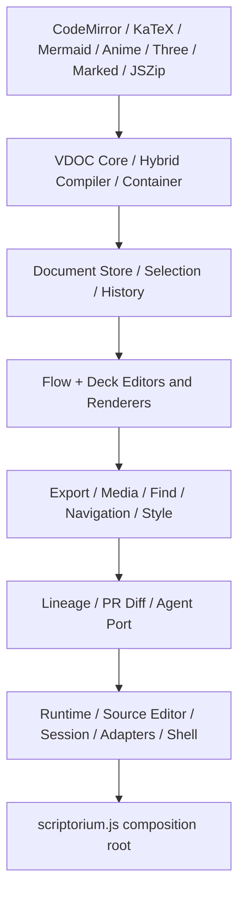
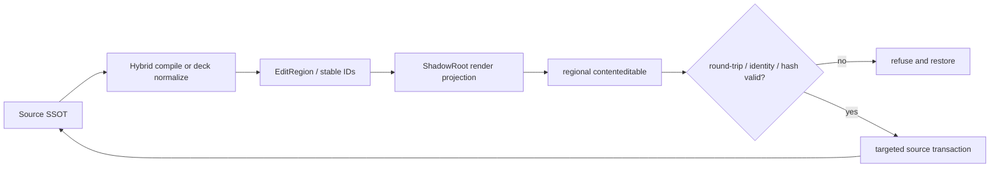
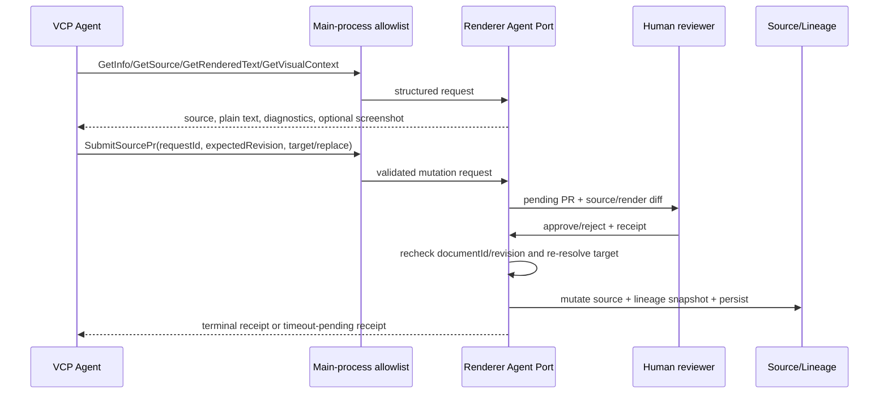

# 01 上游提交与系统架构

## 1. 审计快照

本次没有在 `/home/dudu/VCPChat` 执行 `pull`，因为该参考仓库有本地分支和未推送提交。审计使用临时隔离 checkout，从官方远端获取 `main`，最终固定为：

```text
repository  https://github.com/lioensky/VCPChat.git
commit      17822ca450b95b657d775073066cc277dd56aeea
timestamp   2026-08-12T22:33:37+08:00
subject     fix
verified_at 2026-08-12T22:39:13+08:00
```

重构序列的几个标志点：

| 时间/提交 | 可验证事实 |
|---|---|
| `e032ecb` 07:52 | “超级重构的开始”，混合编译器开始进入仓库 |
| `fb66a52` 13:15 前后 | rendered-text 定向写回模块进入重构序列 |
| `6da013a` 16:45 前后 | store、adapter、editor、agent-port 等模块化边界成形 |
| `ced62fc` 21:25 | 提交信息为“引擎alpha落地啦！” |
| `ebe1f87` 21:57 | 加入新模块及未接线的旧/备份资产 |
| `0ac6a4b` 22:09 | 修正 flow renderer、PR diff、session、shell 等 |
| `3ff0e0c` 22:13 | 修正 lineage、navigation、session 与装配 |
| `45c3098` 22:28 | 收紧 Collaborator 提示词中的 island 脚本写法；未修改运行时实现 |
| `17822ca` 22:33 | 大幅重写 Scriptorium README；未修改 JavaScript 内核 |

从 `e032ecb` 到固定快照共 29 个提交。相对重构前父提交 `deaa02f`，整体差异为 61 个文件、约 `+27,528 / -7,576`。但这个数字被 `scriptorium.origin.js`（约万行）、`scriptorium-runtime.origin.js`、未加载的旧 `scriptorium-agent.js` 以及最终 README 重写显著放大，不能直接当成有效新内核规模。

审计过程中官方远端在约半小时内连续前进四次，说明它仍处于高频 Alpha 收敛期。任何后续实现或兼容工作都必须绑定 commit 和容器版本，不能把 `main` 当作稳定协议。

## 2. 系统定位

Scriptorium 是 VCPChat 内置的本地富文档和演示工作台，面向两类协作者：

- 人类：直接编辑渲染文字、排版、对象和源码；
- Agent：读取文档语义、源码与视觉截图，以 PR 提议修改。

它定义两个自有工程类型：

| 工程 | 场景 | 真源 |
|---|---|---|
| VDOCX `.vdocx` | 连续流文稿 | Markdown-first 混合 Source Buffer + `documentCss` |
| VPPTX `.vpptx` | 逐页演示 | `deckCss` + 每页完整 HTML scene source + notes/transition 等元数据 |

DOCX/PPTX 只是导入源。导入后进入 VDOC 模型，不保证 OOXML 的像素级、可逆或原位编辑。

## 3. 活跃加载链

`scriptorium.html` 先加载第三方运行库，再按依赖顺序加载经典浏览器模块，最后加载组合根 `scriptorium.js`。活跃链可概括为：



关键证据：

- 活跃脚本清单：[`scriptorium.html:908-967`](https://github.com/lioensky/VCPChat/blob/17822ca450b95b657d775073066cc277dd56aeea/ScriptoriumModules/scriptorium.html#L908-L967)
- 组合根的必需模块检查：[`scriptorium.js:4-55`](https://github.com/lioensky/VCPChat/blob/17822ca450b95b657d775073066cc277dd56aeea/ScriptoriumModules/scriptorium.js#L4-L55)
- 端口与控制器装配：[`scriptorium.js:57-93`](https://github.com/lioensky/VCPChat/blob/17822ca450b95b657d775073066cc277dd56aeea/ScriptoriumModules/scriptorium.js#L57-L93)、[`145-265`](https://github.com/lioensky/VCPChat/blob/17822ca450b95b657d775073066cc277dd56aeea/ScriptoriumModules/scriptorium.js#L145-L265)
- 当前 Agent 控制器接线：[`scriptorium.js:606-622`](https://github.com/lioensky/VCPChat/blob/17822ca450b95b657d775073066cc277dd56aeea/ScriptoriumModules/scriptorium.js#L606-L622)

### 活跃实现与未接线资产

| 文件 | 状态 | 依据 |
|---|---|---|
| `scriptorium-agent-port.js` | 活跃 | 被 HTML 加载，并由组合根实例化 |
| `scriptorium-agent.js` | 未加载 | HTML 无脚本引用，组合根也不读取其全局导出 |
| `scriptorium.origin.js` | 未加载备份/原始资产 | 活跃链无引用 |
| `scriptorium-runtime.origin.js` | 未加载备份/原始资产 | 活跃链无引用 |

因此不能用旧 `scriptorium-agent.js` 中更丰富的函数来证明当前产品能力；本研究的 Agent 结论都以 `scriptorium-agent-port.js` 为准。

## 4. 模块所有权

| 模块组 | 唯一职责/边界 |
|---|---|
| `vdoc-core.js` | 工程模型、归一化、HTML/CSS 基础清理、稳定节点 ID、scene 配置 |
| `vdoc-hybrid-compiler.js` | 混合源码扫描、保护、编译、区块/编辑区索引、诊断 |
| `vdoc-container.js` | v2 ZIP 打包/解包、资源 CAS、运行/导出 URL 解析 |
| `scriptorium-document-store.js` | document、path、dirty、revision、generation、resource resolver 的唯一 owner |
| `scriptorium-flow-adapter.js` | VDOCX 源码/CSS/编译缓存/预览的类型边界 |
| `scriptorium-deck-adapter.js` | VPPTX 页源、页选择、共享 CSS 和预览的类型边界 |
| `scriptorium-flow-editor.js` | VDOCX 区域编辑、Selection 映射、源码事务、IME |
| `scriptorium-deck-editor.js` | VPPTX 稳定节点定向回写、格式、插入与选择 |
| `scriptorium-rendered-text.js` | 可见文字指纹、歧义定位、可编程 island 文本回写 |
| `scriptorium-runtime.js` | 文档脚本审查后执行、帧/定时器/清理生命周期 |
| `scriptorium-agent-port.js` | Agent 只读查询、视觉上下文元数据、PR 队列与审批应用 |
| `scriptorium-lineage-store.js` | 人类 checkpoint、PR 状态、快照和回溯 |
| `scriptorium-session.js` | 新建/打开/导入/保存、未保存状态与持久化串行化 |
| `modules/ipc/docxHandlers.js` | Electron 窗口、文件、导入导出、Agent IPC、原子写 |
| `ScriptoriumCollaboratorService.js` | VCP 工具参数与 Agent 易读 Markdown 响应封装 |

这个划分值得借鉴：store 是唯一状态 owner，flow/deck 通过 adapter 多态，editor/render/runtime/Agent 只依赖端口。然而当前实现使用按顺序加载的 `window.ScriptoriumXxx` 全局对象，不适合作为 Vue/TypeScript 模块原样迁移。

## 5. 核心数据流

### 5.1 人类编辑



### 5.2 Agent 协作



### 5.3 保存与资源

```text
DocumentStore
  → container.pack(document, resourceData)
  → manifest/source/checkpoints + SHA-256 resources
  → Uint8Array ZIP
  → preload IPC
  → same-directory temporary file
  → replace target
  → only mark saved if captured context is still current
```

## 6. 上游事实漂移

### 6.1 README 与容器代码曾在同日漂移

审计早期 README 称容器根目录包含 `document.json`，而当时代码已经使用以下布局：

```text
manifest.json
source/document.md
source/document.css
lineage/checkpoints.json
resources/media/<sha256>.<ext>
resources/fonts/<sha256>.<ext>
mimetype
```

最终提交 `17822ca` 已重写 README 并列出同一 v2 布局；容器 JavaScript 未随这两个最终提交改变。依据：[`vdoc-container.js:4-11,84-145`](https://github.com/lioensky/VCPChat/blob/17822ca450b95b657d775073066cc277dd56aeea/ScriptoriumModules/vdoc-container.js#L4-L145)、[`README.md:338-370`](https://github.com/lioensky/VCPChat/blob/17822ca450b95b657d775073066cc277dd56aeea/ScriptoriumModules/README.md#L338-L370)。漂移虽已修复，但“代码先变、协议文档当日再整体改写”仍说明 Alpha 契约尚在收敛。

### 6.2 “最新提交”不等于“最新能力”

`3ff0e0c` 之前的最后两次修正主要涉及 renderer、PR diff、session、shell、lineage 和 navigation；其后的 `45c3098/17822ca` 只修改 Collaborator 提示词和 README。核心 compiler/store/flow-editor/agent-port/runtime/container 均未改变，`ebe1f87` 加回的旧/备份资产也没有进入加载链。判断能力必须从入口追到实例化和调用方，不能只看 `git show --stat`；提示词中的安全约束也不能替代运行时强制。

## 7. 审计边界

上游专项指令明确说明处于全量重构中，并禁止读取/运行旧测试、语法检测和单元测试。本报告因此只声明：

- 已验证提交、活跃加载链、所有者和静态调用链；
- 已提取源码中明确编码的不变量及风险；
- 未验证应用能否启动、编辑旅程能否完成、导入导出保真、性能或恶意输入安全；
- 源码审计发现的竞态/安全缺口是“静态可达风险”，不是本轮动态复现结果。
