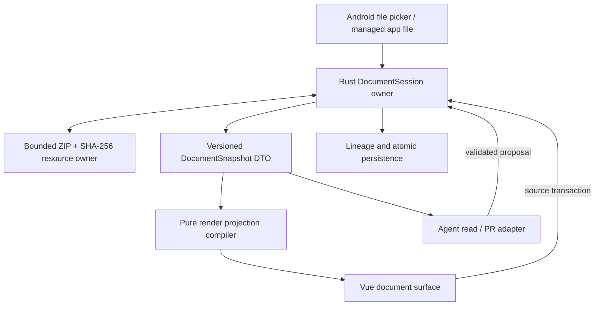

# 04 VCPMobile 技术吸收与分期建议

## 1. 当前 VCPMobile 已有资产

VCPMobile 不是从零开始。当前代码已经具备以下可复用基础：

| 能力 | 当前事实 | 与 Scriptorium 的关系 |
|---|---|---|
| HTML → Agent 上下文 | Rust `html_to_vcp_markdown()` 递归处理标题、强调、列表、链接、代码、媒体、VCP 特殊块 | 可复用格式与结构思想；它不是 sanitizer，不能直接作为 VDOC 导入或 `safeHtml` 边界 |
| HTML 解析 | Rust `scraper + ego-tree` | 只提供解析基础；清洗、URL/CSS 策略和资源准入需另行定义 |
| Markdown | 前端 Marked 18；Rust `pulldown-cmark` | 可建立只读编译核心，但与桌面 Marked 12 输出不能假定相同 |
| 富内容渲染 | DOMPurify、KaTeX、Mermaid、morphdom | 依赖可复用，但必须置于文档专用 HTML/CSS/URL 策略之后 |
| 容器/哈希 | Rust `zip 8.6 + sha2` | 应在 Rust 侧实现有界 VDOC pack/unpack 与资源校验 |
| 文件提取 | DOCX/PPTX/PDF/XLSX 提取，压缩物理文件有 50 MB 前置保护 | 只适合语义提取；该阈值不约束 ZIP 展开量、entry 数、压缩比或 picker 流复制 |
| 并发设施 | Rust owner/epoch、Tokio、DashMap/RwLock；前端已有并发边界测试 | 可承载 generation/documentId/revision |
| 分布式工具 | Rust `ToolRegistry` 和 VCP 分布式节点 | 只可借鉴 transport/manifest；它不提供 PR、lineage 或逐请求审批控制面 |
| 宿主安全边界 | 当前 `csp: null`、asset scope `**`，默认 capability 覆盖主窗口和 `vcp-portal-*` 且授予 `vcp-mobile:allow-all` | 外部文档不得进入主窗口 trusted-rich 路径，也不能获得 Tauri bridge/capability |

证据入口：

- HTML → VCP Markdown：[`context_sanitizer.rs:136-317`](../../src-tauri/src/vcp_modules/chat/context_sanitizer.rs)
- trusted-rich guard 的自述边界：[`astRenderer.ts`](../../src/core/utils/astRenderer.ts)
- HTML Preview 的独立 sandbox 路径：[`HtmlPreviewBlock.vue`](../../src/features/chat/blocks/HtmlPreviewBlock.vue)
- 前端依赖：[`package.json:27-44`](../../package.json)
- Rust 容器/解析依赖：[`src-tauri/Cargo.toml:35-72`](../../src-tauri/Cargo.toml)
- 文件提取上限：[`file_extractor.rs:815-887`](../../src-tauri/src/vcp_modules/infra/file_extractor.rs)
- 可复用的路径/CAS/staging 原语：[`file_manager.rs`](../../src-tauri/src/vcp_modules/infra/file_manager.rs)
- Android picker 与整窗快照实现：[`VcpMobilePlugin.kt`](../../src-tauri/plugins/vcp-mobile/android/src/main/java/com/vcp/mobile/VcpMobilePlugin.kt)
- 整窗快照命令注册：[`vcp-mobile/src/lib.rs`](../../src-tauri/plugins/vcp-mobile/src/lib.rs)
- 当前窗口 capability：[`capabilities/default.json`](../../src-tauri/capabilities/default.json)
- 当前 CSP/asset scope：[`tauri.conf.json`](../../src-tauri/tauri.conf.json)

### 1.1 不要把桌面纯文本抽取覆盖现有转换器

VCPMobile 的 `html_to_vcp_markdown()` 会保留：

- 标题层级、粗体/斜体、列表、链接目标和代码围栏；
- `` 与 `<audio>/<video>` 的来源；
- `data-raw-content` 与 VCP Tool/DailyNote 特殊内容；
- 可选的 thought 结构。

桌面 Scriptorium 的 `textFromHtml()` 只取 `textContent`。它适合文档系统的一份廉价 plain-text view，不适合作为 Mobile 聊天上下文转换器的替代品。未来可以同时提供 `plainText` 和 `vcpMarkdown` 两种投影，不能混成一个字段。

反过来也不能把名字中的 `sanitizer` 当成安全承诺：当前转换器面向已进入聊天上下文的内容，默认递归分支会继续读取未知元素的文字，信任 `data-raw-content`，也没有形成完整的 URL、属性与结构白名单。它只可提供 parser/formatter 经验，不能直接承担 VDOC HTML 导入、`safeHtml` 生成或脚本/CSS 隔离。

## 2. 技术吸收矩阵

| 桌面能力 | Mobile 决策 | 理由 |
|---|---|---|
| Source Buffer 是唯一真相 | **保留** | 避免 live DOM 污染、支持 Agent/人类共享修改面 |
| `generation + documentId + revision` | **保留并强化** | 绑定所有异步任务、PR、保存、媒体和截图 |
| Hybrid Compiler 的保护区/编辑区 | **重写为纯 TS/Rust 核心** | 复用范式，不复制全局 classic-script 模块 |
| `editRegion(sourceRange, sourceHash)` | **保留** | 支持区域渲染和过期拒绝；hash 只作失效检测 |
| VDOC v2 ZIP + SHA-256 CAS | **Rust 侧重写** | 避免 JSZip 多份内存拷贝，集中路径/大小/哈希安全 |
| Agent read API + target/replace PR | **保留协议思想，强化锚点** | 必须加入 generation、唯一 target/range hash 和持久恢复 |
| Lineage + receipt + snapshot | **保留，先做有界版本** | 是可追责协作的核心产品价值 |
| HTML → normalized plain text | **作为额外投影** | 便宜但有损，不能替代结构化语义 |
| 纯文本 + 截图 Visual Context | **改造后保留** | 已有整窗快照可作可行性原语；需补 surface crop、隐私、资源稳定和 revision 一致性，不需要系统截屏权限 |
| VDOCX 区域 contenteditable | **后置验证** | Android IME、Selection、WebView 差异和长文性能风险高 |
| VPPTX 自由画布/对象 GUI | **后置** | 触摸交互、缩放、图层、屏幕空间与工程量过大 |
| 文档内 JavaScript/Anime/Three | **禁止迁移到主 WebView** | 当前桌面不是恶意脚本沙箱；Mobile CSP/asset 范围更敏感 |
| Electron preload/BrowserWindow/PDF | **不迁移** | Tauri/Rust/Android 必须重新实现宿主能力 |
| Mammoth/Cheerio/Turndown 全套导入 | **不在首期引入** | 依赖和内存成本高；已有提取器不等于编辑导入器 |
| 文档 HTML/CSS/URL 安全策略 | **新增专用边界** | DOMPurify 不处理 CSS 语义；默认禁外链、表单、iframe、meta refresh，并只解析同文档已校验 ResourceRef |

## 3. 推荐目标架构

不要再造一套与现有聊天/文件/分布式并行的状态机。建议只增加一个文档领域，由 Rust 持久化 owner 和 Vue 投影层组成：



### 3.1 Rust owner

建议 Rust 独占：

- 当前 document、canonical source、resource index/data；
- generation/documentId/revision/dirty/pending-save；
- 文档资源的明确 owner/refcount；复用现有流式 SHA、canonical containment、staging/safe-rename 等低层原语，不直接套用由 message/topic 生命周期管理的 attachment registry；
- 有界 ZIP 读写、路径校验和 SHA-256；同步 ZIP/编译放入有界执行器，支持 close/cancel/join；
- 应用私有路径的原子保存，以及与外部 `content://` 导出分离的 provider 写入契约；
- source transaction、PR 队列/回执和 lineage 持久化；
- 文档脚本策略（首期恒为 disabled）。

Vue 不维护一份可独立提交的长期 canonical document，只持有版本化 snapshot DTO、当前输入草稿和渲染派生物。这里的“不可变”不等于每次把完整源码、ZIP 和二进制资源跨 IPC 克隆；大资源留在 Rust owner 中，通过 opaque `ResourceRef` 流式解析，IPC 只传必要的有界元数据和文本分片。

### 3.2 纯投影编译器

首期 compiler 可以在 TypeScript 纯模块中复用当前 Marked，HTML 清洗可借助 DOMPurify，但必须建立独立文档策略并满足：

- 无组件状态、无文件/IPC、无全局 `window.ScriptoriumXxx`；
- 输入包含 `source + compilerVersion + documentContext`；
- 输出包含 `safeHtml + plainText + outline + blocks + editRegions + diagnostics`；
- 每个输出明确是派生数据；
- 默认拒绝任意外部 URL、表单、iframe、meta refresh；URL 只允许同一文档内已校验的 opaque `ResourceRef`；
- CSS 由 parser 执行 allowlist 与 surface scope，拒绝 `@import`、外部 `url()` 和覆盖宿主 UI 的规则；不能把 DOMPurify 当 CSS sanitizer；
- SVG、媒体以及 Mermaid/KaTeX 输入分别设结构、资源和复杂度配额；
- 外部文档不挂入主窗口 trusted-rich DOM；未来若使用隔离 WebView，其 label 不得匹配默认 capability，且不授予任何 Tauri 权限；
- Marked 12 与 Mobile Marked 18 必须用 golden corpus 对齐，不能复制桌面预期后默认兼容。

长期若要跨端完全同构，再评估把分区/区间算法移到 Rust/WASM；P1 不应先做双语言编译器。

### 3.3 建议的语义快照

这是 Mobile 的改进建议，不是当前桌面已有 DTO：

```ts
interface DocumentSemanticSnapshot {
  generation: number
  documentId: string
  revision: number
  sourceKind: 'markdown-hybrid' | 'html-scene'
  plainText: string
  vcpMarkdown?: string
  outline: SemanticHeading[]
  blocks: SemanticBlock[]
  media: SemanticMedia[]
  diagnostics: Diagnostic[]
}
```

桌面的 plain text 会丢媒体属性、链接 URL 和表格结构。Mobile 应从编译 IR 直接构造 `outline/blocks/media`，而不是先压扁成 text 再猜回来。`plainText` 只供全文检索或低成本上下文。

## 4. 分期方案

### P0：协议冻结与挑战样本

目标：不接生产 UI，先把可迁移契约钉死。

交付物：

- 固定上游 commit 的 VDOC v2 schema 说明；
- `manifest/source/checkpoints/resources` 的最小合法/非法 fixture；
- 混合源码 corpus：Markdown、inline HTML、重复 island ID、未闭合围栏、数学、Mermaid、表格、媒体 URI；
- HTML import、plain text、VCP Markdown 三种投影的差异样本；
- generation/revision、重复 target、ZIP bomb、路径穿越和资源哈希挑战集；
- 独立冻结压缩字节、展开总量、单 entry、entry 数、压缩比、picker 流复制、图表复杂度和执行时间配额；
- HTML/CSS/URL、表单、SVG、媒体与宿主 capability 逃逸挑战集；
- 明确“当前不承诺与上游后续 Alpha 自动兼容”。

通过条件：schema 和预期输出可独立评审，所有未知项显式列出；不以 README 单独作为协议真相。

### P1：只读 VDOCX spike

范围：

- Android picker 只把输入流式导入为 app-owned copy；当前 `ACTION_GET_CONTENT` 不授予可持续写 URI，也不承诺回写原文件；
- Rust 按压缩量、展开量、单 entry、entry 数、压缩比和流复制预算有界打开/解包/校验 VDOCX；
- 拒绝脚本执行、任意外链、表单、iframe 和 VPPTX；CSS/URL/resource 全部经过上述专用策略；
- Vue 只读渲染 Markdown、静态 HTML、KaTeX、Mermaid 和本地受控资源；
- 文档内容不进入主窗口 trusted-rich 路径，资源只经同文档 CAS 校验后的 opaque `ResourceRef` 提供；
- 目录、plain text、VCP Markdown、媒体清单和诊断；
- 关闭文档时释放 Blob/asset 映射和大对象。

不做：编辑、Agent 写入、Office 保真导入、PDF、Three/Anime。

通过条件：恶意 ZIP/缺失资源/摘要错误 fail closed；代表长文在 Android 真机无 OOM，返回后台/进程重建可恢复或明确关闭。不能把桌面 100 MB 或现有压缩文件 50 MB 前置阈值当作 VDOC 安全额度；各项独立配额先取保守值，再由挑战集与 L8 测量定型。

### P2：源码编辑、保存与 PR

范围：

- 独立 Source 编辑面，实时诊断但显式提交；
- Rust source transaction：`expectedGeneration/documentId/revision/range/hash`；
- 应用私有路径原子保存与“保存完成时上下文仍有效”检查；外部 `content://` 导出/覆盖使用单独 provider 契约，不承诺 rename/fsync 语义；
- Agent 只读接口、PR 入队、人工审批、回执和有界 lineage；
- proposal 与最终执行共用同一校验器；脚本始终 refuse；
- pending PR 可持久恢复或在重启后明确终结为 aborted，不能留下无法审批的 pending。

通过条件：重复 target、文档切换、保存并发、审批并发、重启恢复、拒绝回执和 requestId 幂等均有契约测试。

### P3：区域渲染态编辑

只对已证明可逆的普通 Markdown region 开放，先不支持动态 island：

- 点击后建立源码投影编辑树；
- `project(editor) === originalSlice` 是硬准入；
- expected slice/hash/revision/generation 在 commit 点全部检查；
- IME composition、粘贴、撤销、Selection、硬换行、语法边界单独覆盖；
- 映射失效就恢复 snapshot 并提示，不保留假成功 DOM。

通过条件：中文九宫格/全键盘/语音输入、Gboard、常见厂商 WebView、旋转/前后台、长按选区、重复文本和大文档真机验证通过。

### P4：资源写入与视觉上下文

范围：

- 媒体导入先在临时 staging 中读取/探测，commit 时检查完整 context；
- 资源总量/单项/entry 数/压缩比配额；
- 语义快照与截图绑定同一 revision，资源未稳定时返回诊断；
- 截图只覆盖明确 surface，不将全文文本伪装成 viewport 语义。
- 复用现有 `capture_window_snapshot` 作为可行性原语，但补 rect/crop、前后 context 一致性、稳定条件、遮盖与 compositor coverage；当前整窗 `rootView.draw`、RGB_565、低分辨率且在 UI 线程压缩的结果不能直接当文档视觉真相；
- 明确用户触发或授权，裁掉/遮盖导航、聊天、键盘等非文档 UI，并审计发送方、documentId、revision 和截图范围。

### P5：再评估 VPPTX 与可编程内容

只有前四期有 Android 证据后再决定：

- VPPTX 是独立产品面，不是“顺手支持第二种格式”；
- 可编程内容若确有需求，必须是独立无 Tauri bridge 的隔离执行环境、窄消息协议、CPU/内存/时间配额和可终止 owner；
- 在此之前，`script` 一律作为可审计源码保存但不执行，或直接在导入时拒绝。

## 5. 首期不该复制的桌面依赖

桌面直接加载 CodeMirror 5、Marked 12、JSZip、Anime、Three、Pretext、KaTeX、Mermaid；导入侧还用 Mammoth、Cheerio、Turndown。Mobile 已有 Marked 18、DOMPurify、KaTeX、Mermaid 和 Rust zip/sha2。

因此：

- 不为“看起来一致”引入第二套 Marked；先用 corpus 判断差异；
- 不在 WebView 用 JSZip 处理整个工程；Rust 侧流式/有界处理；
- 不在 P1 引入 Three/Anime/Pretext；
- 不因已有 DOCX/PPTX 文本提取器就宣称支持编辑导入；
- 源码编辑器选型等 P2 真实输入规模和 IME 试验后决定，不先复制 CodeMirror 5。

## 6. 验收矩阵

| 层级 | 要回答的问题 | 不能替代什么 |
|---|---|---|
| 纯函数/fixture | 分区、编译、投影、哈希、唯一锚点是否正确 | WebView/IME |
| Rust 单测 | ZIP 配额、路径、资源哈希、事务和 lineage 是否 fail closed | 文件系统掉电行为 |
| 跨层契约 | TS DTO、Tauri command、权限、revision context 是否一致 | Android 生命周期 |
| Vue 组件 | 状态、诊断、冲突、恢复提示是否正确 | 真机输入法 |
| Android JVM/仪器 | URI、进程重建、文件选择、后台恢复 | 长稳/OOM |
| L7 真机旅程 | 打开、阅读、编辑、冲突、保存、回到应用 | 多设备覆盖 |
| L8 性能/稳定性 | 长文、图片、解包、重编译、内存峰值与 soak | 安全审计 |
| 安全挑战集 | ZIP bomb、XSS、CSS/URL 外联、表单、脚本、桥逃逸、路径与资源投毒 | 产品可用性 |

## 7. 开工前硬条件

1. 用户明确首期是“只读 VDOCX”还是“源码可编辑”；默认建议只读。
2. 冻结 Mobile 自己支持的 VDOC 版本和不兼容错误，不跟随上游 `main` 隐式漂移。
3. 建立独立 truth corpus，尤其覆盖 Marked 12/18 的 token 和换行差异。
4. 定义 ZIP 展开配额与 Android 内存预算，不能照搬桌面 100 MB。
5. 明确脚本默认禁用，且这个决定由 Rust 安全 owner 强制。
6. 冻结“picker 导入 app-owned copy / 私有路径保存 / provider 外部导出”三种文件语义，以及专用 HTML/CSS/URL/ResourceRef 策略。
7. 任何隔离 WebView 都不得匹配现有默认 capability 窗口标签，也不得暴露 Tauri bridge。
8. 任何新增 Rust/Vue 领域模块前按仓库协议先保存当前工作区 checkpoint；当前工作区已有大量用户修改，不应在本研究任务里擅自开工。

## 8. 最终建议

Scriptorium 值得吸收并按 Mobile 架构重写的是一个**文档协作内核**：

```text
canonical source
  + reversible/typed projections
  + context-bound transactions
  + human-reviewed Agent proposals
  + content-addressed resources
  + lineage
```

它不值得照搬的是一个桌面 Electron 页面：

```text
global classic scripts
  + JSZip in renderer
  + same-realm executable documents
  + desktop free canvas
  + implicit 100 MB memory assumptions
```

先把前一组做成可验证协议，后面的 UI 才有稳定地基。
